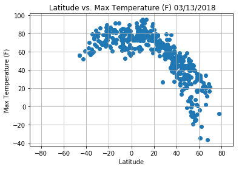
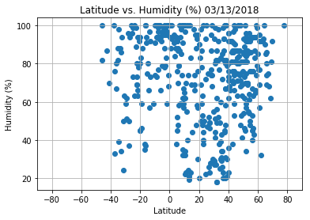
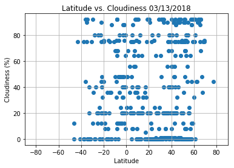
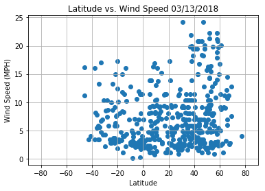

### Python API Analysis
#### WeatherPy Analysis: 

1. There seems to a visible temperature drop in the latitude range of 40-60 (Northern hemisphere). Also, every 20 degrees in latitude is roughly a 20 degrees drop in temperature(F). 

2. The highest concentration of humidity appears to occur in cities located between the 40-60 latitude range (Northern hemisphere). I don't believe there is any relationship between latitude and cloudiness, but based on the plot graph, there are several cities that collect at 0%, 80% and 100%.

3. Cities located in latitudes of the 40-60 range (Northern hemisphere) seem to report the highest wind speed.


```python
# main dependencies
import pandas as pd
from citipy import citipy
import matplotlib.pyplot as plt
import random

# dependencies for OpenWeatherMap API
import json
import requests
from config import api_key
import numpy as np

# dependencies for plots
import time
```


```python
# config info
url = "http://api.openweathermap.org/data/2.5/weather?"
units = "imperial" 
appid = api_key
settings = {"units": "imperial", "appid": api_key}
query_url = f"{url}appid={api_key}&units={units}&q="
query_url
```


    'http://api.openweathermap.org/data/2.5/weather?appid=cb0f4478220431ff8da62d9f9d9102fc&units=imperial&q='


```python
#create empty lists
citylist = []
count = 0
dups = 'no'

for x in range(-90,90,1):
    for y in range(-180,180,1):
        city = citipy.nearest_city(x, y)
        city_dict = {}
        city_dict['city'] = city.city_name
        city_dict['country'] = city.country_code
        city_dict['lat'] = x
        city_dict['long'] = y
        if len(citylist) == 0:
            citylist.append(city_dict)
            count+=1
            continue
        else:
            # no dupes
            for city in citylist:
                if city['city'] == city_dict['city']:
                    dups = 'yes'
        if dups == 'no':
            citylist.append(city_dict)
            count+=1
        else:
            dups = 'no'

print(len(citylist))
```

    7957
    

#### Generate Cities List


```python
# get 50, then later 500 random cities / use list comprehension
citypd = pd.DataFrame({
    'city': [x['city'] for x in citylist],
    'country': [x['country'] for x in citylist],
})

citypd.head()

samplecity = citypd.sample(500)

# test city 45
# print(citylist[45])
```

#### Perform API Calls


```python
count = 0
weather_json = []

for index,row in samplecity.iterrows():
    count+= 1
    query_url = url + "appid=" + api_key + "&units=" + units + "&q=" + row['city']
    try:
        weather_response = requests.get(query_url)
        cityweather = weather_response.json()
        weather_json.append(cityweather)
        city1 = data.get("name")
        city.append(city1)
        country1 = data.get("sys").get("country")
        country.append(country1)
    except:
        #print(f"No data for this city: {row['city']}")
        print(f"Processing Record {count}/500 | {row['city']}")
        print(query_url)

# print success note for a sanity check
print("-"*47)
print("                Data Collected")
print("-"*47)
```

    Processing Record 1/500 | nadym
    http://api.openweathermap.org/data/2.5/weather?appid=cb0f4478220431ff8da62d9f9d9102fc&units=imperial&q=nadym
    Processing Record 2/500 | sarh
    http://api.openweathermap.org/data/2.5/weather?appid=cb0f4478220431ff8da62d9f9d9102fc&units=imperial&q=sarh
    Processing Record 3/500 | itaqui
    http://api.openweathermap.org/data/2.5/weather?appid=cb0f4478220431ff8da62d9f9d9102fc&units=imperial&q=itaqui
    Processing Record 4/500 | gallipoli
    http://api.openweathermap.org/data/2.5/weather?appid=cb0f4478220431ff8da62d9f9d9102fc&units=imperial&q=gallipoli
    Processing Record 5/500 | vologda
    http://api.openweathermap.org/data/2.5/weather?appid=cb0f4478220431ff8da62d9f9d9102fc&units=imperial&q=vologda
    Processing Record 6/500 | ahrarne
    http://api.openweathermap.org/data/2.5/weather?appid=cb0f4478220431ff8da62d9f9d9102fc&units=imperial&q=ahrarne
    Processing Record 7/500 | fastiv
    http://api.openweathermap.org/data/2.5/weather?appid=cb0f4478220431ff8da62d9f9d9102fc&units=imperial&q=fastiv
    Processing Record 8/500 | galdar
    http://api.openweathermap.org/data/2.5/weather?appid=cb0f4478220431ff8da62d9f9d9102fc&units=imperial&q=galdar
    Processing Record 9/500 | idah
    http://api.openweathermap.org/data/2.5/weather?appid=cb0f4478220431ff8da62d9f9d9102fc&units=imperial&q=idah
    Processing Record 10/500 | fulitun
    http://api.openweathermap.org/data/2.5/weather?appid=cb0f4478220431ff8da62d9f9d9102fc&units=imperial&q=fulitun
    Processing Record 11/500 | hays
    http://api.openweathermap.org/data/2.5/weather?appid=cb0f4478220431ff8da62d9f9d9102fc&units=imperial&q=hays
    Processing Record 12/500 | pullampadi
    http://api.openweathermap.org/data/2.5/weather?appid=cb0f4478220431ff8da62d9f9d9102fc&units=imperial&q=pullampadi
    Processing Record 13/500 | siddipet
    http://api.openweathermap.org/data/2.5/weather?appid=cb0f4478220431ff8da62d9f9d9102fc&units=imperial&q=siddipet
    Processing Record 14/500 | sinnamary
    http://api.openweathermap.org/data/2.5/weather?appid=cb0f4478220431ff8da62d9f9d9102fc&units=imperial&q=sinnamary
    Processing Record 15/500 | onega
    http://api.openweathermap.org/data/2.5/weather?appid=cb0f4478220431ff8da62d9f9d9102fc&units=imperial&q=onega
    Processing Record 16/500 | svetlyy
    http://api.openweathermap.org/data/2.5/weather?appid=cb0f4478220431ff8da62d9f9d9102fc&units=imperial&q=svetlyy
    Processing Record 17/500 | janfida
    http://api.openweathermap.org/data/2.5/weather?appid=cb0f4478220431ff8da62d9f9d9102fc&units=imperial&q=janfida
    Processing Record 18/500 | achit
    http://api.openweathermap.org/data/2.5/weather?appid=cb0f4478220431ff8da62d9f9d9102fc&units=imperial&q=achit
    Processing Record 19/500 | karhal
    http://api.openweathermap.org/data/2.5/weather?appid=cb0f4478220431ff8da62d9f9d9102fc&units=imperial&q=karhal
    Processing Record 20/500 | limbe
    http://api.openweathermap.org/data/2.5/weather?appid=cb0f4478220431ff8da62d9f9d9102fc&units=imperial&q=limbe
    Processing Record 21/500 | saint-malo
    http://api.openweathermap.org/data/2.5/weather?appid=cb0f4478220431ff8da62d9f9d9102fc&units=imperial&q=saint-malo
    Processing Record 22/500 | santo domingo
    http://api.openweathermap.org/data/2.5/weather?appid=cb0f4478220431ff8da62d9f9d9102fc&units=imperial&q=santo domingo
    Processing Record 23/500 | ruatoria
    http://api.openweathermap.org/data/2.5/weather?appid=cb0f4478220431ff8da62d9f9d9102fc&units=imperial&q=ruatoria
    Processing Record 24/500 | sangin
    http://api.openweathermap.org/data/2.5/weather?appid=cb0f4478220431ff8da62d9f9d9102fc&units=imperial&q=sangin
    Processing Record 25/500 | jizan
    http://api.openweathermap.org/data/2.5/weather?appid=cb0f4478220431ff8da62d9f9d9102fc&units=imperial&q=jizan
    Processing Record 26/500 | morag
    http://api.openweathermap.org/data/2.5/weather?appid=cb0f4478220431ff8da62d9f9d9102fc&units=imperial&q=morag
    Processing Record 27/500 | katobu
    http://api.openweathermap.org/data/2.5/weather?appid=cb0f4478220431ff8da62d9f9d9102fc&units=imperial&q=katobu
    Processing Record 28/500 | waterlooville
    http://api.openweathermap.org/data/2.5/weather?appid=cb0f4478220431ff8da62d9f9d9102fc&units=imperial&q=waterlooville
    Processing Record 29/500 | tayshet
    http://api.openweathermap.org/data/2.5/weather?appid=cb0f4478220431ff8da62d9f9d9102fc&units=imperial&q=tayshet
    Processing Record 30/500 | la libertad
    http://api.openweathermap.org/data/2.5/weather?appid=cb0f4478220431ff8da62d9f9d9102fc&units=imperial&q=la libertad
    Processing Record 31/500 | kigali
    http://api.openweathermap.org/data/2.5/weather?appid=cb0f4478220431ff8da62d9f9d9102fc&units=imperial&q=kigali
    Processing Record 32/500 | birao
    http://api.openweathermap.org/data/2.5/weather?appid=cb0f4478220431ff8da62d9f9d9102fc&units=imperial&q=birao
    Processing Record 33/500 | tamale
    http://api.openweathermap.org/data/2.5/weather?appid=cb0f4478220431ff8da62d9f9d9102fc&units=imperial&q=tamale
    Processing Record 34/500 | leshukonskoye
    http://api.openweathermap.org/data/2.5/weather?appid=cb0f4478220431ff8da62d9f9d9102fc&units=imperial&q=leshukonskoye
    Processing Record 35/500 | uusikaupunki
    http://api.openweathermap.org/data/2.5/weather?appid=cb0f4478220431ff8da62d9f9d9102fc&units=imperial&q=uusikaupunki
    Processing Record 36/500 | port hardy
    http://api.openweathermap.org/data/2.5/weather?appid=cb0f4478220431ff8da62d9f9d9102fc&units=imperial&q=port hardy
    Processing Record 37/500 | danshui
    http://api.openweathermap.org/data/2.5/weather?appid=cb0f4478220431ff8da62d9f9d9102fc&units=imperial&q=danshui
    Processing Record 38/500 | pangkalanbuun
    http://api.openweathermap.org/data/2.5/weather?appid=cb0f4478220431ff8da62d9f9d9102fc&units=imperial&q=pangkalanbuun
    Processing Record 39/500 | maceio
    http://api.openweathermap.org/data/2.5/weather?appid=cb0f4478220431ff8da62d9f9d9102fc&units=imperial&q=maceio
    Processing Record 40/500 | lamidan
    http://api.openweathermap.org/data/2.5/weather?appid=cb0f4478220431ff8da62d9f9d9102fc&units=imperial&q=lamidan
    Processing Record 41/500 | semporna
    http://api.openweathermap.org/data/2.5/weather?appid=cb0f4478220431ff8da62d9f9d9102fc&units=imperial&q=semporna
    Processing Record 42/500 | carnot
    http://api.openweathermap.org/data/2.5/weather?appid=cb0f4478220431ff8da62d9f9d9102fc&units=imperial&q=carnot
    Processing Record 43/500 | malbork
    http://api.openweathermap.org/data/2.5/weather?appid=cb0f4478220431ff8da62d9f9d9102fc&units=imperial&q=malbork
    Processing Record 44/500 | agdam
    http://api.openweathermap.org/data/2.5/weather?appid=cb0f4478220431ff8da62d9f9d9102fc&units=imperial&q=agdam
    Processing Record 45/500 | archidona
    http://api.openweathermap.org/data/2.5/weather?appid=cb0f4478220431ff8da62d9f9d9102fc&units=imperial&q=archidona
    Processing Record 46/500 | rio novo do sul
    http://api.openweathermap.org/data/2.5/weather?appid=cb0f4478220431ff8da62d9f9d9102fc&units=imperial&q=rio novo do sul
    Processing Record 47/500 | conceicao do araguaia
    http://api.openweathermap.org/data/2.5/weather?appid=cb0f4478220431ff8da62d9f9d9102fc&units=imperial&q=conceicao do araguaia
    Processing Record 48/500 | bontang
    http://api.openweathermap.org/data/2.5/weather?appid=cb0f4478220431ff8da62d9f9d9102fc&units=imperial&q=bontang
    Processing Record 49/500 | bafra
    http://api.openweathermap.org/data/2.5/weather?appid=cb0f4478220431ff8da62d9f9d9102fc&units=imperial&q=bafra
    Processing Record 50/500 | chaohu
    http://api.openweathermap.org/data/2.5/weather?appid=cb0f4478220431ff8da62d9f9d9102fc&units=imperial&q=chaohu
    Processing Record 51/500 | ust-kalmanka
    http://api.openweathermap.org/data/2.5/weather?appid=cb0f4478220431ff8da62d9f9d9102fc&units=imperial&q=ust-kalmanka
    Processing Record 52/500 | nakusp
    http://api.openweathermap.org/data/2.5/weather?appid=cb0f4478220431ff8da62d9f9d9102fc&units=imperial&q=nakusp
    Processing Record 53/500 | nikolayevsk-na-amure
    http://api.openweathermap.org/data/2.5/weather?appid=cb0f4478220431ff8da62d9f9d9102fc&units=imperial&q=nikolayevsk-na-amure
    Processing Record 54/500 | messina
    http://api.openweathermap.org/data/2.5/weather?appid=cb0f4478220431ff8da62d9f9d9102fc&units=imperial&q=messina
    Processing Record 55/500 | yumen
    http://api.openweathermap.org/data/2.5/weather?appid=cb0f4478220431ff8da62d9f9d9102fc&units=imperial&q=yumen
    Processing Record 56/500 | kareli
    http://api.openweathermap.org/data/2.5/weather?appid=cb0f4478220431ff8da62d9f9d9102fc&units=imperial&q=kareli
    Processing Record 57/500 | rio claro
    http://api.openweathermap.org/data/2.5/weather?appid=cb0f4478220431ff8da62d9f9d9102fc&units=imperial&q=rio claro
    Processing Record 58/500 | catuday
    http://api.openweathermap.org/data/2.5/weather?appid=cb0f4478220431ff8da62d9f9d9102fc&units=imperial&q=catuday
    Processing Record 59/500 | bima
    http://api.openweathermap.org/data/2.5/weather?appid=cb0f4478220431ff8da62d9f9d9102fc&units=imperial&q=bima
    Processing Record 60/500 | mabaruma
    http://api.openweathermap.org/data/2.5/weather?appid=cb0f4478220431ff8da62d9f9d9102fc&units=imperial&q=mabaruma
    Processing Record 61/500 | riom
    http://api.openweathermap.org/data/2.5/weather?appid=cb0f4478220431ff8da62d9f9d9102fc&units=imperial&q=riom
    Processing Record 62/500 | coro
    http://api.openweathermap.org/data/2.5/weather?appid=cb0f4478220431ff8da62d9f9d9102fc&units=imperial&q=coro
    Processing Record 63/500 | hurricane
    http://api.openweathermap.org/data/2.5/weather?appid=cb0f4478220431ff8da62d9f9d9102fc&units=imperial&q=hurricane
    Processing Record 64/500 | dodge city
    http://api.openweathermap.org/data/2.5/weather?appid=cb0f4478220431ff8da62d9f9d9102fc&units=imperial&q=dodge city
    Processing Record 65/500 | kibuye
    http://api.openweathermap.org/data/2.5/weather?appid=cb0f4478220431ff8da62d9f9d9102fc&units=imperial&q=kibuye
    Processing Record 66/500 | soderhamn
    http://api.openweathermap.org/data/2.5/weather?appid=cb0f4478220431ff8da62d9f9d9102fc&units=imperial&q=soderhamn
    Processing Record 67/500 | frutal
    http://api.openweathermap.org/data/2.5/weather?appid=cb0f4478220431ff8da62d9f9d9102fc&units=imperial&q=frutal
    Processing Record 68/500 | dutlwe
    http://api.openweathermap.org/data/2.5/weather?appid=cb0f4478220431ff8da62d9f9d9102fc&units=imperial&q=dutlwe
    Processing Record 69/500 | kismayo
    http://api.openweathermap.org/data/2.5/weather?appid=cb0f4478220431ff8da62d9f9d9102fc&units=imperial&q=kismayo
    Processing Record 70/500 | sakiai
    http://api.openweathermap.org/data/2.5/weather?appid=cb0f4478220431ff8da62d9f9d9102fc&units=imperial&q=sakiai
    Processing Record 71/500 | fairlie
    http://api.openweathermap.org/data/2.5/weather?appid=cb0f4478220431ff8da62d9f9d9102fc&units=imperial&q=fairlie
    Processing Record 72/500 | santa isabel
    http://api.openweathermap.org/data/2.5/weather?appid=cb0f4478220431ff8da62d9f9d9102fc&units=imperial&q=santa isabel
    Processing Record 73/500 | jinsha
    http://api.openweathermap.org/data/2.5/weather?appid=cb0f4478220431ff8da62d9f9d9102fc&units=imperial&q=jinsha
    Processing Record 74/500 | touros
    http://api.openweathermap.org/data/2.5/weather?appid=cb0f4478220431ff8da62d9f9d9102fc&units=imperial&q=touros
    Processing Record 75/500 | plotnikovo
    http://api.openweathermap.org/data/2.5/weather?appid=cb0f4478220431ff8da62d9f9d9102fc&units=imperial&q=plotnikovo
    Processing Record 76/500 | texarkana
    http://api.openweathermap.org/data/2.5/weather?appid=cb0f4478220431ff8da62d9f9d9102fc&units=imperial&q=texarkana
    Processing Record 77/500 | taveta
    http://api.openweathermap.org/data/2.5/weather?appid=cb0f4478220431ff8da62d9f9d9102fc&units=imperial&q=taveta
    Processing Record 78/500 | little current
    http://api.openweathermap.org/data/2.5/weather?appid=cb0f4478220431ff8da62d9f9d9102fc&units=imperial&q=little current
    Processing Record 79/500 | canberra
    http://api.openweathermap.org/data/2.5/weather?appid=cb0f4478220431ff8da62d9f9d9102fc&units=imperial&q=canberra
    Processing Record 80/500 | churapcha
    http://api.openweathermap.org/data/2.5/weather?appid=cb0f4478220431ff8da62d9f9d9102fc&units=imperial&q=churapcha
    Processing Record 81/500 | cervo
    http://api.openweathermap.org/data/2.5/weather?appid=cb0f4478220431ff8da62d9f9d9102fc&units=imperial&q=cervo
    Processing Record 82/500 | mahenge
    http://api.openweathermap.org/data/2.5/weather?appid=cb0f4478220431ff8da62d9f9d9102fc&units=imperial&q=mahenge
    Processing Record 83/500 | palembang
    http://api.openweathermap.org/data/2.5/weather?appid=cb0f4478220431ff8da62d9f9d9102fc&units=imperial&q=palembang
    Processing Record 84/500 | priiskovyy
    http://api.openweathermap.org/data/2.5/weather?appid=cb0f4478220431ff8da62d9f9d9102fc&units=imperial&q=priiskovyy
    Processing Record 85/500 | canmore
    http://api.openweathermap.org/data/2.5/weather?appid=cb0f4478220431ff8da62d9f9d9102fc&units=imperial&q=canmore
    Processing Record 86/500 | craigieburn
    http://api.openweathermap.org/data/2.5/weather?appid=cb0f4478220431ff8da62d9f9d9102fc&units=imperial&q=craigieburn
    Processing Record 87/500 | amahai
    http://api.openweathermap.org/data/2.5/weather?appid=cb0f4478220431ff8da62d9f9d9102fc&units=imperial&q=amahai
    Processing Record 88/500 | sierra vista
    http://api.openweathermap.org/data/2.5/weather?appid=cb0f4478220431ff8da62d9f9d9102fc&units=imperial&q=sierra vista
    Processing Record 89/500 | whitley bay
    http://api.openweathermap.org/data/2.5/weather?appid=cb0f4478220431ff8da62d9f9d9102fc&units=imperial&q=whitley bay
    Processing Record 90/500 | tawau
    http://api.openweathermap.org/data/2.5/weather?appid=cb0f4478220431ff8da62d9f9d9102fc&units=imperial&q=tawau
    Processing Record 91/500 | el tigre
    http://api.openweathermap.org/data/2.5/weather?appid=cb0f4478220431ff8da62d9f9d9102fc&units=imperial&q=el tigre
    Processing Record 92/500 | khandbari
    http://api.openweathermap.org/data/2.5/weather?appid=cb0f4478220431ff8da62d9f9d9102fc&units=imperial&q=khandbari
    Processing Record 93/500 | mahadday weyne
    http://api.openweathermap.org/data/2.5/weather?appid=cb0f4478220431ff8da62d9f9d9102fc&units=imperial&q=mahadday weyne
    Processing Record 94/500 | acara
    http://api.openweathermap.org/data/2.5/weather?appid=cb0f4478220431ff8da62d9f9d9102fc&units=imperial&q=acara
    Processing Record 95/500 | pindi gheb
    http://api.openweathermap.org/data/2.5/weather?appid=cb0f4478220431ff8da62d9f9d9102fc&units=imperial&q=pindi gheb
    Processing Record 96/500 | angra
    http://api.openweathermap.org/data/2.5/weather?appid=cb0f4478220431ff8da62d9f9d9102fc&units=imperial&q=angra
    Processing Record 97/500 | yar-sale
    http://api.openweathermap.org/data/2.5/weather?appid=cb0f4478220431ff8da62d9f9d9102fc&units=imperial&q=yar-sale
    Processing Record 98/500 | bondoukou
    http://api.openweathermap.org/data/2.5/weather?appid=cb0f4478220431ff8da62d9f9d9102fc&units=imperial&q=bondoukou
    Processing Record 99/500 | torata
    http://api.openweathermap.org/data/2.5/weather?appid=cb0f4478220431ff8da62d9f9d9102fc&units=imperial&q=torata
    Processing Record 100/500 | tepalcatepec
    http://api.openweathermap.org/data/2.5/weather?appid=cb0f4478220431ff8da62d9f9d9102fc&units=imperial&q=tepalcatepec
    Processing Record 101/500 | louis trichardt
    http://api.openweathermap.org/data/2.5/weather?appid=cb0f4478220431ff8da62d9f9d9102fc&units=imperial&q=louis trichardt
    Processing Record 102/500 | turukhansk
    http://api.openweathermap.org/data/2.5/weather?appid=cb0f4478220431ff8da62d9f9d9102fc&units=imperial&q=turukhansk
    Processing Record 103/500 | haverfordwest
    http://api.openweathermap.org/data/2.5/weather?appid=cb0f4478220431ff8da62d9f9d9102fc&units=imperial&q=haverfordwest
    Processing Record 104/500 | ujhani
    http://api.openweathermap.org/data/2.5/weather?appid=cb0f4478220431ff8da62d9f9d9102fc&units=imperial&q=ujhani
    Processing Record 105/500 | beatrice
    http://api.openweathermap.org/data/2.5/weather?appid=cb0f4478220431ff8da62d9f9d9102fc&units=imperial&q=beatrice
    Processing Record 106/500 | juterbog
    http://api.openweathermap.org/data/2.5/weather?appid=cb0f4478220431ff8da62d9f9d9102fc&units=imperial&q=juterbog
    Processing Record 107/500 | libourne
    http://api.openweathermap.org/data/2.5/weather?appid=cb0f4478220431ff8da62d9f9d9102fc&units=imperial&q=libourne
    Processing Record 108/500 | jiaocheng
    http://api.openweathermap.org/data/2.5/weather?appid=cb0f4478220431ff8da62d9f9d9102fc&units=imperial&q=jiaocheng
    Processing Record 109/500 | ambanja
    http://api.openweathermap.org/data/2.5/weather?appid=cb0f4478220431ff8da62d9f9d9102fc&units=imperial&q=ambanja
    Processing Record 110/500 | beruwala
    http://api.openweathermap.org/data/2.5/weather?appid=cb0f4478220431ff8da62d9f9d9102fc&units=imperial&q=beruwala
    Processing Record 111/500 | chilliwack
    http://api.openweathermap.org/data/2.5/weather?appid=cb0f4478220431ff8da62d9f9d9102fc&units=imperial&q=chilliwack
    Processing Record 112/500 | xunchang
    http://api.openweathermap.org/data/2.5/weather?appid=cb0f4478220431ff8da62d9f9d9102fc&units=imperial&q=xunchang
    Processing Record 113/500 | nassau
    http://api.openweathermap.org/data/2.5/weather?appid=cb0f4478220431ff8da62d9f9d9102fc&units=imperial&q=nassau
    Processing Record 114/500 | bababe
    http://api.openweathermap.org/data/2.5/weather?appid=cb0f4478220431ff8da62d9f9d9102fc&units=imperial&q=bababe
    Processing Record 115/500 | arrecife
    http://api.openweathermap.org/data/2.5/weather?appid=cb0f4478220431ff8da62d9f9d9102fc&units=imperial&q=arrecife
    Processing Record 116/500 | rzhaksa
    http://api.openweathermap.org/data/2.5/weather?appid=cb0f4478220431ff8da62d9f9d9102fc&units=imperial&q=rzhaksa
    Processing Record 117/500 | kankan
    http://api.openweathermap.org/data/2.5/weather?appid=cb0f4478220431ff8da62d9f9d9102fc&units=imperial&q=kankan
    Processing Record 118/500 | sarandi
    http://api.openweathermap.org/data/2.5/weather?appid=cb0f4478220431ff8da62d9f9d9102fc&units=imperial&q=sarandi
    Processing Record 119/500 | tandil
    http://api.openweathermap.org/data/2.5/weather?appid=cb0f4478220431ff8da62d9f9d9102fc&units=imperial&q=tandil
    Processing Record 120/500 | owensboro
    http://api.openweathermap.org/data/2.5/weather?appid=cb0f4478220431ff8da62d9f9d9102fc&units=imperial&q=owensboro
    Processing Record 121/500 | zhumadian
    http://api.openweathermap.org/data/2.5/weather?appid=cb0f4478220431ff8da62d9f9d9102fc&units=imperial&q=zhumadian
    Processing Record 122/500 | ankara
    http://api.openweathermap.org/data/2.5/weather?appid=cb0f4478220431ff8da62d9f9d9102fc&units=imperial&q=ankara
    Processing Record 123/500 | manokwari
    http://api.openweathermap.org/data/2.5/weather?appid=cb0f4478220431ff8da62d9f9d9102fc&units=imperial&q=manokwari
    Processing Record 124/500 | melito di porto salvo
    http://api.openweathermap.org/data/2.5/weather?appid=cb0f4478220431ff8da62d9f9d9102fc&units=imperial&q=melito di porto salvo
    Processing Record 125/500 | bongandanga
    http://api.openweathermap.org/data/2.5/weather?appid=cb0f4478220431ff8da62d9f9d9102fc&units=imperial&q=bongandanga
    Processing Record 126/500 | izazi
    http://api.openweathermap.org/data/2.5/weather?appid=cb0f4478220431ff8da62d9f9d9102fc&units=imperial&q=izazi
    Processing Record 127/500 | killybegs
    http://api.openweathermap.org/data/2.5/weather?appid=cb0f4478220431ff8da62d9f9d9102fc&units=imperial&q=killybegs
    Processing Record 128/500 | cua
    http://api.openweathermap.org/data/2.5/weather?appid=cb0f4478220431ff8da62d9f9d9102fc&units=imperial&q=cua
    Processing Record 129/500 | bolshiye uki
    http://api.openweathermap.org/data/2.5/weather?appid=cb0f4478220431ff8da62d9f9d9102fc&units=imperial&q=bolshiye uki
    Processing Record 130/500 | masumbwe
    http://api.openweathermap.org/data/2.5/weather?appid=cb0f4478220431ff8da62d9f9d9102fc&units=imperial&q=masumbwe
    Processing Record 131/500 | khorixas
    http://api.openweathermap.org/data/2.5/weather?appid=cb0f4478220431ff8da62d9f9d9102fc&units=imperial&q=khorixas
    Processing Record 132/500 | magdagachi
    http://api.openweathermap.org/data/2.5/weather?appid=cb0f4478220431ff8da62d9f9d9102fc&units=imperial&q=magdagachi
    Processing Record 133/500 | rupert
    http://api.openweathermap.org/data/2.5/weather?appid=cb0f4478220431ff8da62d9f9d9102fc&units=imperial&q=rupert
    Processing Record 134/500 | bayji
    http://api.openweathermap.org/data/2.5/weather?appid=cb0f4478220431ff8da62d9f9d9102fc&units=imperial&q=bayji
    Processing Record 135/500 | ninh binh
    http://api.openweathermap.org/data/2.5/weather?appid=cb0f4478220431ff8da62d9f9d9102fc&units=imperial&q=ninh binh
    Processing Record 136/500 | jatibonico
    http://api.openweathermap.org/data/2.5/weather?appid=cb0f4478220431ff8da62d9f9d9102fc&units=imperial&q=jatibonico
    Processing Record 137/500 | tonantins
    http://api.openweathermap.org/data/2.5/weather?appid=cb0f4478220431ff8da62d9f9d9102fc&units=imperial&q=tonantins
    Processing Record 138/500 | kargasok
    http://api.openweathermap.org/data/2.5/weather?appid=cb0f4478220431ff8da62d9f9d9102fc&units=imperial&q=kargasok
    Processing Record 139/500 | cintalapa
    http://api.openweathermap.org/data/2.5/weather?appid=cb0f4478220431ff8da62d9f9d9102fc&units=imperial&q=cintalapa
    Processing Record 140/500 | union
    http://api.openweathermap.org/data/2.5/weather?appid=cb0f4478220431ff8da62d9f9d9102fc&units=imperial&q=union
    Processing Record 141/500 | iramuco
    http://api.openweathermap.org/data/2.5/weather?appid=cb0f4478220431ff8da62d9f9d9102fc&units=imperial&q=iramuco
    Processing Record 142/500 | tallahassee
    http://api.openweathermap.org/data/2.5/weather?appid=cb0f4478220431ff8da62d9f9d9102fc&units=imperial&q=tallahassee
    Processing Record 143/500 | jeremie
    http://api.openweathermap.org/data/2.5/weather?appid=cb0f4478220431ff8da62d9f9d9102fc&units=imperial&q=jeremie
    Processing Record 144/500 | great falls
    http://api.openweathermap.org/data/2.5/weather?appid=cb0f4478220431ff8da62d9f9d9102fc&units=imperial&q=great falls
    Processing Record 145/500 | olbia
    http://api.openweathermap.org/data/2.5/weather?appid=cb0f4478220431ff8da62d9f9d9102fc&units=imperial&q=olbia
    Processing Record 146/500 | sattahip
    http://api.openweathermap.org/data/2.5/weather?appid=cb0f4478220431ff8da62d9f9d9102fc&units=imperial&q=sattahip
    Processing Record 147/500 | camacha
    http://api.openweathermap.org/data/2.5/weather?appid=cb0f4478220431ff8da62d9f9d9102fc&units=imperial&q=camacha
    Processing Record 148/500 | wodonga
    http://api.openweathermap.org/data/2.5/weather?appid=cb0f4478220431ff8da62d9f9d9102fc&units=imperial&q=wodonga
    Processing Record 149/500 | puerto cabello
    http://api.openweathermap.org/data/2.5/weather?appid=cb0f4478220431ff8da62d9f9d9102fc&units=imperial&q=puerto cabello
    Processing Record 150/500 | bilaspur
    http://api.openweathermap.org/data/2.5/weather?appid=cb0f4478220431ff8da62d9f9d9102fc&units=imperial&q=bilaspur
    Processing Record 151/500 | sjenica
    http://api.openweathermap.org/data/2.5/weather?appid=cb0f4478220431ff8da62d9f9d9102fc&units=imperial&q=sjenica
    Processing Record 152/500 | brasileia
    http://api.openweathermap.org/data/2.5/weather?appid=cb0f4478220431ff8da62d9f9d9102fc&units=imperial&q=brasileia
    Processing Record 153/500 | turtkul
    http://api.openweathermap.org/data/2.5/weather?appid=cb0f4478220431ff8da62d9f9d9102fc&units=imperial&q=turtkul
    Processing Record 154/500 | sansai
    http://api.openweathermap.org/data/2.5/weather?appid=cb0f4478220431ff8da62d9f9d9102fc&units=imperial&q=sansai
    Processing Record 155/500 | arkadelphia
    http://api.openweathermap.org/data/2.5/weather?appid=cb0f4478220431ff8da62d9f9d9102fc&units=imperial&q=arkadelphia
    Processing Record 156/500 | carroll
    http://api.openweathermap.org/data/2.5/weather?appid=cb0f4478220431ff8da62d9f9d9102fc&units=imperial&q=carroll
    Processing Record 157/500 | gorom-gorom
    http://api.openweathermap.org/data/2.5/weather?appid=cb0f4478220431ff8da62d9f9d9102fc&units=imperial&q=gorom-gorom
    Processing Record 158/500 | verkhovyna
    http://api.openweathermap.org/data/2.5/weather?appid=cb0f4478220431ff8da62d9f9d9102fc&units=imperial&q=verkhovyna
    Processing Record 159/500 | cedar city
    http://api.openweathermap.org/data/2.5/weather?appid=cb0f4478220431ff8da62d9f9d9102fc&units=imperial&q=cedar city
    Processing Record 160/500 | greenwood
    http://api.openweathermap.org/data/2.5/weather?appid=cb0f4478220431ff8da62d9f9d9102fc&units=imperial&q=greenwood
    Processing Record 161/500 | kuandian
    http://api.openweathermap.org/data/2.5/weather?appid=cb0f4478220431ff8da62d9f9d9102fc&units=imperial&q=kuandian
    Processing Record 162/500 | santa cruz de tenerife
    http://api.openweathermap.org/data/2.5/weather?appid=cb0f4478220431ff8da62d9f9d9102fc&units=imperial&q=santa cruz de tenerife
    Processing Record 163/500 | sirsa
    http://api.openweathermap.org/data/2.5/weather?appid=cb0f4478220431ff8da62d9f9d9102fc&units=imperial&q=sirsa
    Processing Record 164/500 | urambo
    http://api.openweathermap.org/data/2.5/weather?appid=cb0f4478220431ff8da62d9f9d9102fc&units=imperial&q=urambo
    Processing Record 165/500 | zapolyarnyy
    http://api.openweathermap.org/data/2.5/weather?appid=cb0f4478220431ff8da62d9f9d9102fc&units=imperial&q=zapolyarnyy
    Processing Record 166/500 | kampot
    http://api.openweathermap.org/data/2.5/weather?appid=cb0f4478220431ff8da62d9f9d9102fc&units=imperial&q=kampot
    Processing Record 167/500 | east london
    http://api.openweathermap.org/data/2.5/weather?appid=cb0f4478220431ff8da62d9f9d9102fc&units=imperial&q=east london
    Processing Record 168/500 | nobres
    http://api.openweathermap.org/data/2.5/weather?appid=cb0f4478220431ff8da62d9f9d9102fc&units=imperial&q=nobres
    Processing Record 169/500 | ewa beach
    http://api.openweathermap.org/data/2.5/weather?appid=cb0f4478220431ff8da62d9f9d9102fc&units=imperial&q=ewa beach
    Processing Record 170/500 | hay river
    http://api.openweathermap.org/data/2.5/weather?appid=cb0f4478220431ff8da62d9f9d9102fc&units=imperial&q=hay river
    Processing Record 171/500 | rurrenabaque
    http://api.openweathermap.org/data/2.5/weather?appid=cb0f4478220431ff8da62d9f9d9102fc&units=imperial&q=rurrenabaque
    Processing Record 172/500 | shaunavon
    http://api.openweathermap.org/data/2.5/weather?appid=cb0f4478220431ff8da62d9f9d9102fc&units=imperial&q=shaunavon
    Processing Record 173/500 | sakata
    http://api.openweathermap.org/data/2.5/weather?appid=cb0f4478220431ff8da62d9f9d9102fc&units=imperial&q=sakata
    Processing Record 174/500 | kingman
    http://api.openweathermap.org/data/2.5/weather?appid=cb0f4478220431ff8da62d9f9d9102fc&units=imperial&q=kingman
    Processing Record 175/500 | yacuiba
    http://api.openweathermap.org/data/2.5/weather?appid=cb0f4478220431ff8da62d9f9d9102fc&units=imperial&q=yacuiba
    Processing Record 176/500 | santa eulalia del rio
    http://api.openweathermap.org/data/2.5/weather?appid=cb0f4478220431ff8da62d9f9d9102fc&units=imperial&q=santa eulalia del rio
    Processing Record 177/500 | sawakin
    http://api.openweathermap.org/data/2.5/weather?appid=cb0f4478220431ff8da62d9f9d9102fc&units=imperial&q=sawakin
    Processing Record 178/500 | kerouane
    http://api.openweathermap.org/data/2.5/weather?appid=cb0f4478220431ff8da62d9f9d9102fc&units=imperial&q=kerouane
    Processing Record 179/500 | maykain
    http://api.openweathermap.org/data/2.5/weather?appid=cb0f4478220431ff8da62d9f9d9102fc&units=imperial&q=maykain
    Processing Record 180/500 | gedo
    http://api.openweathermap.org/data/2.5/weather?appid=cb0f4478220431ff8da62d9f9d9102fc&units=imperial&q=gedo
    Processing Record 181/500 | galashki
    http://api.openweathermap.org/data/2.5/weather?appid=cb0f4478220431ff8da62d9f9d9102fc&units=imperial&q=galashki
    Processing Record 182/500 | toungoo
    http://api.openweathermap.org/data/2.5/weather?appid=cb0f4478220431ff8da62d9f9d9102fc&units=imperial&q=toungoo
    Processing Record 183/500 | santa comba
    http://api.openweathermap.org/data/2.5/weather?appid=cb0f4478220431ff8da62d9f9d9102fc&units=imperial&q=santa comba
    Processing Record 184/500 | bordighera
    http://api.openweathermap.org/data/2.5/weather?appid=cb0f4478220431ff8da62d9f9d9102fc&units=imperial&q=bordighera
    Processing Record 185/500 | ajdabiya
    http://api.openweathermap.org/data/2.5/weather?appid=cb0f4478220431ff8da62d9f9d9102fc&units=imperial&q=ajdabiya
    Processing Record 186/500 | zhaoyang
    http://api.openweathermap.org/data/2.5/weather?appid=cb0f4478220431ff8da62d9f9d9102fc&units=imperial&q=zhaoyang
    Processing Record 187/500 | stillwater
    http://api.openweathermap.org/data/2.5/weather?appid=cb0f4478220431ff8da62d9f9d9102fc&units=imperial&q=stillwater
    Processing Record 188/500 | bako
    http://api.openweathermap.org/data/2.5/weather?appid=cb0f4478220431ff8da62d9f9d9102fc&units=imperial&q=bako
    Processing Record 189/500 | manosque
    http://api.openweathermap.org/data/2.5/weather?appid=cb0f4478220431ff8da62d9f9d9102fc&units=imperial&q=manosque
    Processing Record 190/500 | tanete
    http://api.openweathermap.org/data/2.5/weather?appid=cb0f4478220431ff8da62d9f9d9102fc&units=imperial&q=tanete
    Processing Record 191/500 | chiang klang
    http://api.openweathermap.org/data/2.5/weather?appid=cb0f4478220431ff8da62d9f9d9102fc&units=imperial&q=chiang klang
    Processing Record 192/500 | bacuit
    http://api.openweathermap.org/data/2.5/weather?appid=cb0f4478220431ff8da62d9f9d9102fc&units=imperial&q=bacuit
    Processing Record 193/500 | loukhi
    http://api.openweathermap.org/data/2.5/weather?appid=cb0f4478220431ff8da62d9f9d9102fc&units=imperial&q=loukhi
    Processing Record 194/500 | oeiras do para
    http://api.openweathermap.org/data/2.5/weather?appid=cb0f4478220431ff8da62d9f9d9102fc&units=imperial&q=oeiras do para
    Processing Record 195/500 | pinar del rio
    http://api.openweathermap.org/data/2.5/weather?appid=cb0f4478220431ff8da62d9f9d9102fc&units=imperial&q=pinar del rio
    Processing Record 196/500 | teguldet
    http://api.openweathermap.org/data/2.5/weather?appid=cb0f4478220431ff8da62d9f9d9102fc&units=imperial&q=teguldet
    Processing Record 197/500 | colorado springs
    http://api.openweathermap.org/data/2.5/weather?appid=cb0f4478220431ff8da62d9f9d9102fc&units=imperial&q=colorado springs
    Processing Record 198/500 | musoma
    http://api.openweathermap.org/data/2.5/weather?appid=cb0f4478220431ff8da62d9f9d9102fc&units=imperial&q=musoma
    Processing Record 199/500 | riberalta
    http://api.openweathermap.org/data/2.5/weather?appid=cb0f4478220431ff8da62d9f9d9102fc&units=imperial&q=riberalta
    Processing Record 200/500 | yerofey pavlovich
    http://api.openweathermap.org/data/2.5/weather?appid=cb0f4478220431ff8da62d9f9d9102fc&units=imperial&q=yerofey pavlovich
    Processing Record 201/500 | kanniyakumari
    http://api.openweathermap.org/data/2.5/weather?appid=cb0f4478220431ff8da62d9f9d9102fc&units=imperial&q=kanniyakumari
    Processing Record 202/500 | mildmay
    http://api.openweathermap.org/data/2.5/weather?appid=cb0f4478220431ff8da62d9f9d9102fc&units=imperial&q=mildmay
    Processing Record 203/500 | kande
    http://api.openweathermap.org/data/2.5/weather?appid=cb0f4478220431ff8da62d9f9d9102fc&units=imperial&q=kande
    Processing Record 204/500 | karangampel
    http://api.openweathermap.org/data/2.5/weather?appid=cb0f4478220431ff8da62d9f9d9102fc&units=imperial&q=karangampel
    Processing Record 205/500 | ebolowa
    http://api.openweathermap.org/data/2.5/weather?appid=cb0f4478220431ff8da62d9f9d9102fc&units=imperial&q=ebolowa
    Processing Record 206/500 | odessa
    http://api.openweathermap.org/data/2.5/weather?appid=cb0f4478220431ff8da62d9f9d9102fc&units=imperial&q=odessa
    Processing Record 207/500 | staryy biser
    http://api.openweathermap.org/data/2.5/weather?appid=cb0f4478220431ff8da62d9f9d9102fc&units=imperial&q=staryy biser
    Processing Record 208/500 | dunmore east
    http://api.openweathermap.org/data/2.5/weather?appid=cb0f4478220431ff8da62d9f9d9102fc&units=imperial&q=dunmore east
    Processing Record 209/500 | ilhabela
    http://api.openweathermap.org/data/2.5/weather?appid=cb0f4478220431ff8da62d9f9d9102fc&units=imperial&q=ilhabela
    Processing Record 210/500 | charlottetown
    http://api.openweathermap.org/data/2.5/weather?appid=cb0f4478220431ff8da62d9f9d9102fc&units=imperial&q=charlottetown
    Processing Record 211/500 | udimskiy
    http://api.openweathermap.org/data/2.5/weather?appid=cb0f4478220431ff8da62d9f9d9102fc&units=imperial&q=udimskiy
    Processing Record 212/500 | houma
    http://api.openweathermap.org/data/2.5/weather?appid=cb0f4478220431ff8da62d9f9d9102fc&units=imperial&q=houma
    Processing Record 213/500 | williams lake
    http://api.openweathermap.org/data/2.5/weather?appid=cb0f4478220431ff8da62d9f9d9102fc&units=imperial&q=williams lake
    Processing Record 214/500 | banjar
    http://api.openweathermap.org/data/2.5/weather?appid=cb0f4478220431ff8da62d9f9d9102fc&units=imperial&q=banjar
    Processing Record 215/500 | santo tomas
    http://api.openweathermap.org/data/2.5/weather?appid=cb0f4478220431ff8da62d9f9d9102fc&units=imperial&q=santo tomas
    Processing Record 216/500 | koshurnikovo
    http://api.openweathermap.org/data/2.5/weather?appid=cb0f4478220431ff8da62d9f9d9102fc&units=imperial&q=koshurnikovo
    Processing Record 217/500 | yining
    http://api.openweathermap.org/data/2.5/weather?appid=cb0f4478220431ff8da62d9f9d9102fc&units=imperial&q=yining
    Processing Record 218/500 | melilla
    http://api.openweathermap.org/data/2.5/weather?appid=cb0f4478220431ff8da62d9f9d9102fc&units=imperial&q=melilla
    Processing Record 219/500 | mhlume
    http://api.openweathermap.org/data/2.5/weather?appid=cb0f4478220431ff8da62d9f9d9102fc&units=imperial&q=mhlume
    Processing Record 220/500 | leninskoye
    http://api.openweathermap.org/data/2.5/weather?appid=cb0f4478220431ff8da62d9f9d9102fc&units=imperial&q=leninskoye
    Processing Record 221/500 | masterton
    http://api.openweathermap.org/data/2.5/weather?appid=cb0f4478220431ff8da62d9f9d9102fc&units=imperial&q=masterton
    Processing Record 222/500 | bolshoy uluy
    http://api.openweathermap.org/data/2.5/weather?appid=cb0f4478220431ff8da62d9f9d9102fc&units=imperial&q=bolshoy uluy
    Processing Record 223/500 | gigmoto
    http://api.openweathermap.org/data/2.5/weather?appid=cb0f4478220431ff8da62d9f9d9102fc&units=imperial&q=gigmoto
    Processing Record 224/500 | mezen
    http://api.openweathermap.org/data/2.5/weather?appid=cb0f4478220431ff8da62d9f9d9102fc&units=imperial&q=mezen
    Processing Record 225/500 | arandis
    http://api.openweathermap.org/data/2.5/weather?appid=cb0f4478220431ff8da62d9f9d9102fc&units=imperial&q=arandis
    Processing Record 226/500 | abbeville
    http://api.openweathermap.org/data/2.5/weather?appid=cb0f4478220431ff8da62d9f9d9102fc&units=imperial&q=abbeville
    Processing Record 227/500 | shushtar
    http://api.openweathermap.org/data/2.5/weather?appid=cb0f4478220431ff8da62d9f9d9102fc&units=imperial&q=shushtar
    Processing Record 228/500 | east brainerd
    http://api.openweathermap.org/data/2.5/weather?appid=cb0f4478220431ff8da62d9f9d9102fc&units=imperial&q=east brainerd
    Processing Record 229/500 | gordeyevka
    http://api.openweathermap.org/data/2.5/weather?appid=cb0f4478220431ff8da62d9f9d9102fc&units=imperial&q=gordeyevka
    Processing Record 230/500 | olinda
    http://api.openweathermap.org/data/2.5/weather?appid=cb0f4478220431ff8da62d9f9d9102fc&units=imperial&q=olinda
    Processing Record 231/500 | harper
    http://api.openweathermap.org/data/2.5/weather?appid=cb0f4478220431ff8da62d9f9d9102fc&units=imperial&q=harper
    Processing Record 232/500 | macheng
    http://api.openweathermap.org/data/2.5/weather?appid=cb0f4478220431ff8da62d9f9d9102fc&units=imperial&q=macheng
    Processing Record 233/500 | gaogou
    http://api.openweathermap.org/data/2.5/weather?appid=cb0f4478220431ff8da62d9f9d9102fc&units=imperial&q=gaogou
    Processing Record 234/500 | hobart
    http://api.openweathermap.org/data/2.5/weather?appid=cb0f4478220431ff8da62d9f9d9102fc&units=imperial&q=hobart
    Processing Record 235/500 | butterworth
    http://api.openweathermap.org/data/2.5/weather?appid=cb0f4478220431ff8da62d9f9d9102fc&units=imperial&q=butterworth
    Processing Record 236/500 | sao miguel do araguaia
    http://api.openweathermap.org/data/2.5/weather?appid=cb0f4478220431ff8da62d9f9d9102fc&units=imperial&q=sao miguel do araguaia
    Processing Record 237/500 | ambilobe
    http://api.openweathermap.org/data/2.5/weather?appid=cb0f4478220431ff8da62d9f9d9102fc&units=imperial&q=ambilobe
    Processing Record 238/500 | koulikoro
    http://api.openweathermap.org/data/2.5/weather?appid=cb0f4478220431ff8da62d9f9d9102fc&units=imperial&q=koulikoro
    Processing Record 239/500 | san clemente
    http://api.openweathermap.org/data/2.5/weather?appid=cb0f4478220431ff8da62d9f9d9102fc&units=imperial&q=san clemente
    Processing Record 240/500 | santa marta
    http://api.openweathermap.org/data/2.5/weather?appid=cb0f4478220431ff8da62d9f9d9102fc&units=imperial&q=santa marta
    Processing Record 241/500 | tucuman
    http://api.openweathermap.org/data/2.5/weather?appid=cb0f4478220431ff8da62d9f9d9102fc&units=imperial&q=tucuman
    Processing Record 242/500 | mahasamund
    http://api.openweathermap.org/data/2.5/weather?appid=cb0f4478220431ff8da62d9f9d9102fc&units=imperial&q=mahasamund
    Processing Record 243/500 | uniontown
    http://api.openweathermap.org/data/2.5/weather?appid=cb0f4478220431ff8da62d9f9d9102fc&units=imperial&q=uniontown
    Processing Record 244/500 | saint-jean-port-joli
    http://api.openweathermap.org/data/2.5/weather?appid=cb0f4478220431ff8da62d9f9d9102fc&units=imperial&q=saint-jean-port-joli
    Processing Record 245/500 | ryotsu
    http://api.openweathermap.org/data/2.5/weather?appid=cb0f4478220431ff8da62d9f9d9102fc&units=imperial&q=ryotsu
    Processing Record 246/500 | grand baie
    http://api.openweathermap.org/data/2.5/weather?appid=cb0f4478220431ff8da62d9f9d9102fc&units=imperial&q=grand baie
    Processing Record 247/500 | karaul
    http://api.openweathermap.org/data/2.5/weather?appid=cb0f4478220431ff8da62d9f9d9102fc&units=imperial&q=karaul
    Processing Record 248/500 | divnomorskoye
    http://api.openweathermap.org/data/2.5/weather?appid=cb0f4478220431ff8da62d9f9d9102fc&units=imperial&q=divnomorskoye
    Processing Record 249/500 | merrill
    http://api.openweathermap.org/data/2.5/weather?appid=cb0f4478220431ff8da62d9f9d9102fc&units=imperial&q=merrill
    Processing Record 250/500 | alta gracia
    http://api.openweathermap.org/data/2.5/weather?appid=cb0f4478220431ff8da62d9f9d9102fc&units=imperial&q=alta gracia
    Processing Record 251/500 | ichhawar
    http://api.openweathermap.org/data/2.5/weather?appid=cb0f4478220431ff8da62d9f9d9102fc&units=imperial&q=ichhawar
    Processing Record 252/500 | tuggurt
    http://api.openweathermap.org/data/2.5/weather?appid=cb0f4478220431ff8da62d9f9d9102fc&units=imperial&q=tuggurt
    Processing Record 253/500 | uyemskiy
    http://api.openweathermap.org/data/2.5/weather?appid=cb0f4478220431ff8da62d9f9d9102fc&units=imperial&q=uyemskiy
    Processing Record 254/500 | ust-omchug
    http://api.openweathermap.org/data/2.5/weather?appid=cb0f4478220431ff8da62d9f9d9102fc&units=imperial&q=ust-omchug
    Processing Record 255/500 | knin
    http://api.openweathermap.org/data/2.5/weather?appid=cb0f4478220431ff8da62d9f9d9102fc&units=imperial&q=knin
    Processing Record 256/500 | miquelon
    http://api.openweathermap.org/data/2.5/weather?appid=cb0f4478220431ff8da62d9f9d9102fc&units=imperial&q=miquelon
    Processing Record 257/500 | berezayka
    http://api.openweathermap.org/data/2.5/weather?appid=cb0f4478220431ff8da62d9f9d9102fc&units=imperial&q=berezayka
    Processing Record 258/500 | sao joao da barra
    http://api.openweathermap.org/data/2.5/weather?appid=cb0f4478220431ff8da62d9f9d9102fc&units=imperial&q=sao joao da barra
    Processing Record 259/500 | ranghulu
    http://api.openweathermap.org/data/2.5/weather?appid=cb0f4478220431ff8da62d9f9d9102fc&units=imperial&q=ranghulu
    Processing Record 260/500 | santa fe
    http://api.openweathermap.org/data/2.5/weather?appid=cb0f4478220431ff8da62d9f9d9102fc&units=imperial&q=santa fe
    Processing Record 261/500 | chuguyevka
    http://api.openweathermap.org/data/2.5/weather?appid=cb0f4478220431ff8da62d9f9d9102fc&units=imperial&q=chuguyevka
    Processing Record 262/500 | mbaiki
    http://api.openweathermap.org/data/2.5/weather?appid=cb0f4478220431ff8da62d9f9d9102fc&units=imperial&q=mbaiki
    Processing Record 263/500 | vondrozo
    http://api.openweathermap.org/data/2.5/weather?appid=cb0f4478220431ff8da62d9f9d9102fc&units=imperial&q=vondrozo
    Processing Record 264/500 | baherden
    http://api.openweathermap.org/data/2.5/weather?appid=cb0f4478220431ff8da62d9f9d9102fc&units=imperial&q=baherden
    Processing Record 265/500 | mae hong son
    http://api.openweathermap.org/data/2.5/weather?appid=cb0f4478220431ff8da62d9f9d9102fc&units=imperial&q=mae hong son
    Processing Record 266/500 | gresham
    http://api.openweathermap.org/data/2.5/weather?appid=cb0f4478220431ff8da62d9f9d9102fc&units=imperial&q=gresham
    Processing Record 267/500 | cabras
    http://api.openweathermap.org/data/2.5/weather?appid=cb0f4478220431ff8da62d9f9d9102fc&units=imperial&q=cabras
    Processing Record 268/500 | oloron-sainte-marie
    http://api.openweathermap.org/data/2.5/weather?appid=cb0f4478220431ff8da62d9f9d9102fc&units=imperial&q=oloron-sainte-marie
    Processing Record 269/500 | maralal
    http://api.openweathermap.org/data/2.5/weather?appid=cb0f4478220431ff8da62d9f9d9102fc&units=imperial&q=maralal
    Processing Record 270/500 | tarudant
    http://api.openweathermap.org/data/2.5/weather?appid=cb0f4478220431ff8da62d9f9d9102fc&units=imperial&q=tarudant
    Processing Record 271/500 | kayankulam
    http://api.openweathermap.org/data/2.5/weather?appid=cb0f4478220431ff8da62d9f9d9102fc&units=imperial&q=kayankulam
    Processing Record 272/500 | usevya
    http://api.openweathermap.org/data/2.5/weather?appid=cb0f4478220431ff8da62d9f9d9102fc&units=imperial&q=usevya
    Processing Record 273/500 | marevo
    http://api.openweathermap.org/data/2.5/weather?appid=cb0f4478220431ff8da62d9f9d9102fc&units=imperial&q=marevo
    Processing Record 274/500 | mizan teferi
    http://api.openweathermap.org/data/2.5/weather?appid=cb0f4478220431ff8da62d9f9d9102fc&units=imperial&q=mizan teferi
    Processing Record 275/500 | salina
    http://api.openweathermap.org/data/2.5/weather?appid=cb0f4478220431ff8da62d9f9d9102fc&units=imperial&q=salina
    Processing Record 276/500 | sabinas
    http://api.openweathermap.org/data/2.5/weather?appid=cb0f4478220431ff8da62d9f9d9102fc&units=imperial&q=sabinas
    Processing Record 277/500 | goderich
    http://api.openweathermap.org/data/2.5/weather?appid=cb0f4478220431ff8da62d9f9d9102fc&units=imperial&q=goderich
    Processing Record 278/500 | soubre
    http://api.openweathermap.org/data/2.5/weather?appid=cb0f4478220431ff8da62d9f9d9102fc&units=imperial&q=soubre
    Processing Record 279/500 | blagoveshchenka
    http://api.openweathermap.org/data/2.5/weather?appid=cb0f4478220431ff8da62d9f9d9102fc&units=imperial&q=blagoveshchenka
    Processing Record 280/500 | la celia
    http://api.openweathermap.org/data/2.5/weather?appid=cb0f4478220431ff8da62d9f9d9102fc&units=imperial&q=la celia
    Processing Record 281/500 | ye
    http://api.openweathermap.org/data/2.5/weather?appid=cb0f4478220431ff8da62d9f9d9102fc&units=imperial&q=ye
    Processing Record 282/500 | otautau
    http://api.openweathermap.org/data/2.5/weather?appid=cb0f4478220431ff8da62d9f9d9102fc&units=imperial&q=otautau
    Processing Record 283/500 | manta
    http://api.openweathermap.org/data/2.5/weather?appid=cb0f4478220431ff8da62d9f9d9102fc&units=imperial&q=manta
    Processing Record 284/500 | rybinsk
    http://api.openweathermap.org/data/2.5/weather?appid=cb0f4478220431ff8da62d9f9d9102fc&units=imperial&q=rybinsk
    Processing Record 285/500 | bagdarin
    http://api.openweathermap.org/data/2.5/weather?appid=cb0f4478220431ff8da62d9f9d9102fc&units=imperial&q=bagdarin
    Processing Record 286/500 | vaitape
    http://api.openweathermap.org/data/2.5/weather?appid=cb0f4478220431ff8da62d9f9d9102fc&units=imperial&q=vaitape
    Processing Record 287/500 | mikhaylovskoye
    http://api.openweathermap.org/data/2.5/weather?appid=cb0f4478220431ff8da62d9f9d9102fc&units=imperial&q=mikhaylovskoye
    Processing Record 288/500 | kathu
    http://api.openweathermap.org/data/2.5/weather?appid=cb0f4478220431ff8da62d9f9d9102fc&units=imperial&q=kathu
    Processing Record 289/500 | pontes e lacerda
    http://api.openweathermap.org/data/2.5/weather?appid=cb0f4478220431ff8da62d9f9d9102fc&units=imperial&q=pontes e lacerda
    Processing Record 290/500 | danilov
    http://api.openweathermap.org/data/2.5/weather?appid=cb0f4478220431ff8da62d9f9d9102fc&units=imperial&q=danilov
    Processing Record 291/500 | bowmore
    http://api.openweathermap.org/data/2.5/weather?appid=cb0f4478220431ff8da62d9f9d9102fc&units=imperial&q=bowmore
    Processing Record 292/500 | payyannur
    http://api.openweathermap.org/data/2.5/weather?appid=cb0f4478220431ff8da62d9f9d9102fc&units=imperial&q=payyannur
    Processing Record 293/500 | chiredzi
    http://api.openweathermap.org/data/2.5/weather?appid=cb0f4478220431ff8da62d9f9d9102fc&units=imperial&q=chiredzi
    Processing Record 294/500 | goksun
    http://api.openweathermap.org/data/2.5/weather?appid=cb0f4478220431ff8da62d9f9d9102fc&units=imperial&q=goksun
    Processing Record 295/500 | kurumkan
    http://api.openweathermap.org/data/2.5/weather?appid=cb0f4478220431ff8da62d9f9d9102fc&units=imperial&q=kurumkan
    Processing Record 296/500 | shakiso
    http://api.openweathermap.org/data/2.5/weather?appid=cb0f4478220431ff8da62d9f9d9102fc&units=imperial&q=shakiso
    Processing Record 297/500 | tigil
    http://api.openweathermap.org/data/2.5/weather?appid=cb0f4478220431ff8da62d9f9d9102fc&units=imperial&q=tigil
    Processing Record 298/500 | mariental
    http://api.openweathermap.org/data/2.5/weather?appid=cb0f4478220431ff8da62d9f9d9102fc&units=imperial&q=mariental
    Processing Record 299/500 | rio cuarto
    http://api.openweathermap.org/data/2.5/weather?appid=cb0f4478220431ff8da62d9f9d9102fc&units=imperial&q=rio cuarto
    Processing Record 300/500 | karaj
    http://api.openweathermap.org/data/2.5/weather?appid=cb0f4478220431ff8da62d9f9d9102fc&units=imperial&q=karaj
    Processing Record 301/500 | bolonchen
    http://api.openweathermap.org/data/2.5/weather?appid=cb0f4478220431ff8da62d9f9d9102fc&units=imperial&q=bolonchen
    Processing Record 302/500 | bandar-e torkaman
    http://api.openweathermap.org/data/2.5/weather?appid=cb0f4478220431ff8da62d9f9d9102fc&units=imperial&q=bandar-e torkaman
    Processing Record 303/500 | kununurra
    http://api.openweathermap.org/data/2.5/weather?appid=cb0f4478220431ff8da62d9f9d9102fc&units=imperial&q=kununurra
    Processing Record 304/500 | salinas
    http://api.openweathermap.org/data/2.5/weather?appid=cb0f4478220431ff8da62d9f9d9102fc&units=imperial&q=salinas
    Processing Record 305/500 | talavera de la reina
    http://api.openweathermap.org/data/2.5/weather?appid=cb0f4478220431ff8da62d9f9d9102fc&units=imperial&q=talavera de la reina
    Processing Record 306/500 | cuenca
    http://api.openweathermap.org/data/2.5/weather?appid=cb0f4478220431ff8da62d9f9d9102fc&units=imperial&q=cuenca
    Processing Record 307/500 | utiroa
    http://api.openweathermap.org/data/2.5/weather?appid=cb0f4478220431ff8da62d9f9d9102fc&units=imperial&q=utiroa
    Processing Record 308/500 | kontagora
    http://api.openweathermap.org/data/2.5/weather?appid=cb0f4478220431ff8da62d9f9d9102fc&units=imperial&q=kontagora
    Processing Record 309/500 | kalispell
    http://api.openweathermap.org/data/2.5/weather?appid=cb0f4478220431ff8da62d9f9d9102fc&units=imperial&q=kalispell
    Processing Record 310/500 | roros
    http://api.openweathermap.org/data/2.5/weather?appid=cb0f4478220431ff8da62d9f9d9102fc&units=imperial&q=roros
    Processing Record 311/500 | yanan
    http://api.openweathermap.org/data/2.5/weather?appid=cb0f4478220431ff8da62d9f9d9102fc&units=imperial&q=yanan
    Processing Record 312/500 | verkhoyansk
    http://api.openweathermap.org/data/2.5/weather?appid=cb0f4478220431ff8da62d9f9d9102fc&units=imperial&q=verkhoyansk
    Processing Record 313/500 | akureyri
    http://api.openweathermap.org/data/2.5/weather?appid=cb0f4478220431ff8da62d9f9d9102fc&units=imperial&q=akureyri
    Processing Record 314/500 | komatipoort
    http://api.openweathermap.org/data/2.5/weather?appid=cb0f4478220431ff8da62d9f9d9102fc&units=imperial&q=komatipoort
    Processing Record 315/500 | mount hagen
    http://api.openweathermap.org/data/2.5/weather?appid=cb0f4478220431ff8da62d9f9d9102fc&units=imperial&q=mount hagen
    Processing Record 316/500 | shebunino
    http://api.openweathermap.org/data/2.5/weather?appid=cb0f4478220431ff8da62d9f9d9102fc&units=imperial&q=shebunino
    Processing Record 317/500 | bocas del toro
    http://api.openweathermap.org/data/2.5/weather?appid=cb0f4478220431ff8da62d9f9d9102fc&units=imperial&q=bocas del toro
    Processing Record 318/500 | gremyachye
    http://api.openweathermap.org/data/2.5/weather?appid=cb0f4478220431ff8da62d9f9d9102fc&units=imperial&q=gremyachye
    Processing Record 319/500 | nola
    http://api.openweathermap.org/data/2.5/weather?appid=cb0f4478220431ff8da62d9f9d9102fc&units=imperial&q=nola
    Processing Record 320/500 | vawkavysk
    http://api.openweathermap.org/data/2.5/weather?appid=cb0f4478220431ff8da62d9f9d9102fc&units=imperial&q=vawkavysk
    Processing Record 321/500 | scottsboro
    http://api.openweathermap.org/data/2.5/weather?appid=cb0f4478220431ff8da62d9f9d9102fc&units=imperial&q=scottsboro
    Processing Record 322/500 | kirksville
    http://api.openweathermap.org/data/2.5/weather?appid=cb0f4478220431ff8da62d9f9d9102fc&units=imperial&q=kirksville
    Processing Record 323/500 | cananeia
    http://api.openweathermap.org/data/2.5/weather?appid=cb0f4478220431ff8da62d9f9d9102fc&units=imperial&q=cananeia
    Processing Record 324/500 | ejea de los caballeros
    http://api.openweathermap.org/data/2.5/weather?appid=cb0f4478220431ff8da62d9f9d9102fc&units=imperial&q=ejea de los caballeros
    Processing Record 325/500 | boda
    http://api.openweathermap.org/data/2.5/weather?appid=cb0f4478220431ff8da62d9f9d9102fc&units=imperial&q=boda
    Processing Record 326/500 | las choapas
    http://api.openweathermap.org/data/2.5/weather?appid=cb0f4478220431ff8da62d9f9d9102fc&units=imperial&q=las choapas
    Processing Record 327/500 | olafsvik
    http://api.openweathermap.org/data/2.5/weather?appid=cb0f4478220431ff8da62d9f9d9102fc&units=imperial&q=olafsvik
    Processing Record 328/500 | kavaratti
    http://api.openweathermap.org/data/2.5/weather?appid=cb0f4478220431ff8da62d9f9d9102fc&units=imperial&q=kavaratti
    Processing Record 329/500 | ures
    http://api.openweathermap.org/data/2.5/weather?appid=cb0f4478220431ff8da62d9f9d9102fc&units=imperial&q=ures
    Processing Record 330/500 | tadpatri
    http://api.openweathermap.org/data/2.5/weather?appid=cb0f4478220431ff8da62d9f9d9102fc&units=imperial&q=tadpatri
    Processing Record 331/500 | tyukhtet
    http://api.openweathermap.org/data/2.5/weather?appid=cb0f4478220431ff8da62d9f9d9102fc&units=imperial&q=tyukhtet
    Processing Record 332/500 | tumbotino
    http://api.openweathermap.org/data/2.5/weather?appid=cb0f4478220431ff8da62d9f9d9102fc&units=imperial&q=tumbotino
    Processing Record 333/500 | esso
    http://api.openweathermap.org/data/2.5/weather?appid=cb0f4478220431ff8da62d9f9d9102fc&units=imperial&q=esso
    Processing Record 334/500 | belem de sao francisco
    http://api.openweathermap.org/data/2.5/weather?appid=cb0f4478220431ff8da62d9f9d9102fc&units=imperial&q=belem de sao francisco
    Processing Record 335/500 | rock sound
    http://api.openweathermap.org/data/2.5/weather?appid=cb0f4478220431ff8da62d9f9d9102fc&units=imperial&q=rock sound
    Processing Record 336/500 | suar
    http://api.openweathermap.org/data/2.5/weather?appid=cb0f4478220431ff8da62d9f9d9102fc&units=imperial&q=suar
    Processing Record 337/500 | kaka
    http://api.openweathermap.org/data/2.5/weather?appid=cb0f4478220431ff8da62d9f9d9102fc&units=imperial&q=kaka
    Processing Record 338/500 | jaramana
    http://api.openweathermap.org/data/2.5/weather?appid=cb0f4478220431ff8da62d9f9d9102fc&units=imperial&q=jaramana
    Processing Record 339/500 | maumere
    http://api.openweathermap.org/data/2.5/weather?appid=cb0f4478220431ff8da62d9f9d9102fc&units=imperial&q=maumere
    Processing Record 340/500 | acapulco
    http://api.openweathermap.org/data/2.5/weather?appid=cb0f4478220431ff8da62d9f9d9102fc&units=imperial&q=acapulco
    Processing Record 341/500 | kanungu
    http://api.openweathermap.org/data/2.5/weather?appid=cb0f4478220431ff8da62d9f9d9102fc&units=imperial&q=kanungu
    Processing Record 342/500 | akhmeta
    http://api.openweathermap.org/data/2.5/weather?appid=cb0f4478220431ff8da62d9f9d9102fc&units=imperial&q=akhmeta
    Processing Record 343/500 | tafresh
    http://api.openweathermap.org/data/2.5/weather?appid=cb0f4478220431ff8da62d9f9d9102fc&units=imperial&q=tafresh
    Processing Record 344/500 | nazarovo
    http://api.openweathermap.org/data/2.5/weather?appid=cb0f4478220431ff8da62d9f9d9102fc&units=imperial&q=nazarovo
    Processing Record 345/500 | hornepayne
    http://api.openweathermap.org/data/2.5/weather?appid=cb0f4478220431ff8da62d9f9d9102fc&units=imperial&q=hornepayne
    Processing Record 346/500 | jaleswar
    http://api.openweathermap.org/data/2.5/weather?appid=cb0f4478220431ff8da62d9f9d9102fc&units=imperial&q=jaleswar
    Processing Record 347/500 | sungaipenuh
    http://api.openweathermap.org/data/2.5/weather?appid=cb0f4478220431ff8da62d9f9d9102fc&units=imperial&q=sungaipenuh
    Processing Record 348/500 | rio brilhante
    http://api.openweathermap.org/data/2.5/weather?appid=cb0f4478220431ff8da62d9f9d9102fc&units=imperial&q=rio brilhante
    Processing Record 349/500 | tuatapere
    http://api.openweathermap.org/data/2.5/weather?appid=cb0f4478220431ff8da62d9f9d9102fc&units=imperial&q=tuatapere
    Processing Record 350/500 | mergui
    http://api.openweathermap.org/data/2.5/weather?appid=cb0f4478220431ff8da62d9f9d9102fc&units=imperial&q=mergui
    Processing Record 351/500 | korcula
    http://api.openweathermap.org/data/2.5/weather?appid=cb0f4478220431ff8da62d9f9d9102fc&units=imperial&q=korcula
    Processing Record 352/500 | sao jose de ribamar
    http://api.openweathermap.org/data/2.5/weather?appid=cb0f4478220431ff8da62d9f9d9102fc&units=imperial&q=sao jose de ribamar
    Processing Record 353/500 | liniere
    http://api.openweathermap.org/data/2.5/weather?appid=cb0f4478220431ff8da62d9f9d9102fc&units=imperial&q=liniere
    Processing Record 354/500 | inuvik
    http://api.openweathermap.org/data/2.5/weather?appid=cb0f4478220431ff8da62d9f9d9102fc&units=imperial&q=inuvik
    Processing Record 355/500 | santa margherita ligure
    http://api.openweathermap.org/data/2.5/weather?appid=cb0f4478220431ff8da62d9f9d9102fc&units=imperial&q=santa margherita ligure
    Processing Record 356/500 | hailin
    http://api.openweathermap.org/data/2.5/weather?appid=cb0f4478220431ff8da62d9f9d9102fc&units=imperial&q=hailin
    Processing Record 357/500 | malkara
    http://api.openweathermap.org/data/2.5/weather?appid=cb0f4478220431ff8da62d9f9d9102fc&units=imperial&q=malkara
    Processing Record 358/500 | killorglin
    http://api.openweathermap.org/data/2.5/weather?appid=cb0f4478220431ff8da62d9f9d9102fc&units=imperial&q=killorglin
    Processing Record 359/500 | thomasville
    http://api.openweathermap.org/data/2.5/weather?appid=cb0f4478220431ff8da62d9f9d9102fc&units=imperial&q=thomasville
    Processing Record 360/500 | cockburn town
    http://api.openweathermap.org/data/2.5/weather?appid=cb0f4478220431ff8da62d9f9d9102fc&units=imperial&q=cockburn town
    Processing Record 361/500 | banmo
    http://api.openweathermap.org/data/2.5/weather?appid=cb0f4478220431ff8da62d9f9d9102fc&units=imperial&q=banmo
    Processing Record 362/500 | wenchi
    http://api.openweathermap.org/data/2.5/weather?appid=cb0f4478220431ff8da62d9f9d9102fc&units=imperial&q=wenchi
    Processing Record 363/500 | kautokeino
    http://api.openweathermap.org/data/2.5/weather?appid=cb0f4478220431ff8da62d9f9d9102fc&units=imperial&q=kautokeino
    Processing Record 364/500 | ostersund
    http://api.openweathermap.org/data/2.5/weather?appid=cb0f4478220431ff8da62d9f9d9102fc&units=imperial&q=ostersund
    Processing Record 365/500 | codroipo
    http://api.openweathermap.org/data/2.5/weather?appid=cb0f4478220431ff8da62d9f9d9102fc&units=imperial&q=codroipo
    Processing Record 366/500 | paredon
    http://api.openweathermap.org/data/2.5/weather?appid=cb0f4478220431ff8da62d9f9d9102fc&units=imperial&q=paredon
    Processing Record 367/500 | matata
    http://api.openweathermap.org/data/2.5/weather?appid=cb0f4478220431ff8da62d9f9d9102fc&units=imperial&q=matata
    Processing Record 368/500 | glasgow
    http://api.openweathermap.org/data/2.5/weather?appid=cb0f4478220431ff8da62d9f9d9102fc&units=imperial&q=glasgow
    Processing Record 369/500 | bataipora
    http://api.openweathermap.org/data/2.5/weather?appid=cb0f4478220431ff8da62d9f9d9102fc&units=imperial&q=bataipora
    Processing Record 370/500 | am timan
    http://api.openweathermap.org/data/2.5/weather?appid=cb0f4478220431ff8da62d9f9d9102fc&units=imperial&q=am timan
    Processing Record 371/500 | shu
    http://api.openweathermap.org/data/2.5/weather?appid=cb0f4478220431ff8da62d9f9d9102fc&units=imperial&q=shu
    Processing Record 372/500 | zlotoryja
    http://api.openweathermap.org/data/2.5/weather?appid=cb0f4478220431ff8da62d9f9d9102fc&units=imperial&q=zlotoryja
    Processing Record 373/500 | peresichna
    http://api.openweathermap.org/data/2.5/weather?appid=cb0f4478220431ff8da62d9f9d9102fc&units=imperial&q=peresichna
    Processing Record 374/500 | lillooet
    http://api.openweathermap.org/data/2.5/weather?appid=cb0f4478220431ff8da62d9f9d9102fc&units=imperial&q=lillooet
    Processing Record 375/500 | krasnyy kut
    http://api.openweathermap.org/data/2.5/weather?appid=cb0f4478220431ff8da62d9f9d9102fc&units=imperial&q=krasnyy kut
    Processing Record 376/500 | kyabram
    http://api.openweathermap.org/data/2.5/weather?appid=cb0f4478220431ff8da62d9f9d9102fc&units=imperial&q=kyabram
    Processing Record 377/500 | srandakan
    http://api.openweathermap.org/data/2.5/weather?appid=cb0f4478220431ff8da62d9f9d9102fc&units=imperial&q=srandakan
    Processing Record 378/500 | karachev
    http://api.openweathermap.org/data/2.5/weather?appid=cb0f4478220431ff8da62d9f9d9102fc&units=imperial&q=karachev
    Processing Record 379/500 | suez
    http://api.openweathermap.org/data/2.5/weather?appid=cb0f4478220431ff8da62d9f9d9102fc&units=imperial&q=suez
    Processing Record 380/500 | amuntai
    http://api.openweathermap.org/data/2.5/weather?appid=cb0f4478220431ff8da62d9f9d9102fc&units=imperial&q=amuntai
    Processing Record 381/500 | muscat
    http://api.openweathermap.org/data/2.5/weather?appid=cb0f4478220431ff8da62d9f9d9102fc&units=imperial&q=muscat
    Processing Record 382/500 | goulburn
    http://api.openweathermap.org/data/2.5/weather?appid=cb0f4478220431ff8da62d9f9d9102fc&units=imperial&q=goulburn
    Processing Record 383/500 | maues
    http://api.openweathermap.org/data/2.5/weather?appid=cb0f4478220431ff8da62d9f9d9102fc&units=imperial&q=maues
    Processing Record 384/500 | sindand
    http://api.openweathermap.org/data/2.5/weather?appid=cb0f4478220431ff8da62d9f9d9102fc&units=imperial&q=sindand
    Processing Record 385/500 | rocha
    http://api.openweathermap.org/data/2.5/weather?appid=cb0f4478220431ff8da62d9f9d9102fc&units=imperial&q=rocha
    Processing Record 386/500 | gueret
    http://api.openweathermap.org/data/2.5/weather?appid=cb0f4478220431ff8da62d9f9d9102fc&units=imperial&q=gueret
    Processing Record 387/500 | msanga
    http://api.openweathermap.org/data/2.5/weather?appid=cb0f4478220431ff8da62d9f9d9102fc&units=imperial&q=msanga
    Processing Record 388/500 | brokopondo
    http://api.openweathermap.org/data/2.5/weather?appid=cb0f4478220431ff8da62d9f9d9102fc&units=imperial&q=brokopondo
    Processing Record 389/500 | santa vitoria
    http://api.openweathermap.org/data/2.5/weather?appid=cb0f4478220431ff8da62d9f9d9102fc&units=imperial&q=santa vitoria
    Processing Record 390/500 | altagracia de orituco
    http://api.openweathermap.org/data/2.5/weather?appid=cb0f4478220431ff8da62d9f9d9102fc&units=imperial&q=altagracia de orituco
    Processing Record 391/500 | makokou
    http://api.openweathermap.org/data/2.5/weather?appid=cb0f4478220431ff8da62d9f9d9102fc&units=imperial&q=makokou
    Processing Record 392/500 | lumsden
    http://api.openweathermap.org/data/2.5/weather?appid=cb0f4478220431ff8da62d9f9d9102fc&units=imperial&q=lumsden
    Processing Record 393/500 | dera baba nanak
    http://api.openweathermap.org/data/2.5/weather?appid=cb0f4478220431ff8da62d9f9d9102fc&units=imperial&q=dera baba nanak
    Processing Record 394/500 | grand forks
    http://api.openweathermap.org/data/2.5/weather?appid=cb0f4478220431ff8da62d9f9d9102fc&units=imperial&q=grand forks
    Processing Record 395/500 | gweta
    http://api.openweathermap.org/data/2.5/weather?appid=cb0f4478220431ff8da62d9f9d9102fc&units=imperial&q=gweta
    Processing Record 396/500 | linqiong
    http://api.openweathermap.org/data/2.5/weather?appid=cb0f4478220431ff8da62d9f9d9102fc&units=imperial&q=linqiong
    Processing Record 397/500 | balsas
    http://api.openweathermap.org/data/2.5/weather?appid=cb0f4478220431ff8da62d9f9d9102fc&units=imperial&q=balsas
    Processing Record 398/500 | lawrenceburg
    http://api.openweathermap.org/data/2.5/weather?appid=cb0f4478220431ff8da62d9f9d9102fc&units=imperial&q=lawrenceburg
    Processing Record 399/500 | chaa-khol
    http://api.openweathermap.org/data/2.5/weather?appid=cb0f4478220431ff8da62d9f9d9102fc&units=imperial&q=chaa-khol
    Processing Record 400/500 | bonga
    http://api.openweathermap.org/data/2.5/weather?appid=cb0f4478220431ff8da62d9f9d9102fc&units=imperial&q=bonga
    Processing Record 401/500 | xiaolingwei
    http://api.openweathermap.org/data/2.5/weather?appid=cb0f4478220431ff8da62d9f9d9102fc&units=imperial&q=xiaolingwei
    Processing Record 402/500 | komarikhinskiy
    http://api.openweathermap.org/data/2.5/weather?appid=cb0f4478220431ff8da62d9f9d9102fc&units=imperial&q=komarikhinskiy
    Processing Record 403/500 | babanusah
    http://api.openweathermap.org/data/2.5/weather?appid=cb0f4478220431ff8da62d9f9d9102fc&units=imperial&q=babanusah
    Processing Record 404/500 | estrela
    http://api.openweathermap.org/data/2.5/weather?appid=cb0f4478220431ff8da62d9f9d9102fc&units=imperial&q=estrela
    Processing Record 405/500 | meyzieu
    http://api.openweathermap.org/data/2.5/weather?appid=cb0f4478220431ff8da62d9f9d9102fc&units=imperial&q=meyzieu
    Processing Record 406/500 | bastia
    http://api.openweathermap.org/data/2.5/weather?appid=cb0f4478220431ff8da62d9f9d9102fc&units=imperial&q=bastia
    Processing Record 407/500 | kihei
    http://api.openweathermap.org/data/2.5/weather?appid=cb0f4478220431ff8da62d9f9d9102fc&units=imperial&q=kihei
    Processing Record 408/500 | caboolture
    http://api.openweathermap.org/data/2.5/weather?appid=cb0f4478220431ff8da62d9f9d9102fc&units=imperial&q=caboolture
    Processing Record 409/500 | cowra
    http://api.openweathermap.org/data/2.5/weather?appid=cb0f4478220431ff8da62d9f9d9102fc&units=imperial&q=cowra
    Processing Record 410/500 | stepnogorsk
    http://api.openweathermap.org/data/2.5/weather?appid=cb0f4478220431ff8da62d9f9d9102fc&units=imperial&q=stepnogorsk
    Processing Record 411/500 | methoni
    http://api.openweathermap.org/data/2.5/weather?appid=cb0f4478220431ff8da62d9f9d9102fc&units=imperial&q=methoni
    Processing Record 412/500 | angoche
    http://api.openweathermap.org/data/2.5/weather?appid=cb0f4478220431ff8da62d9f9d9102fc&units=imperial&q=angoche
    Processing Record 413/500 | alamosa
    http://api.openweathermap.org/data/2.5/weather?appid=cb0f4478220431ff8da62d9f9d9102fc&units=imperial&q=alamosa
    Processing Record 414/500 | qaanaaq
    http://api.openweathermap.org/data/2.5/weather?appid=cb0f4478220431ff8da62d9f9d9102fc&units=imperial&q=qaanaaq
    Processing Record 415/500 | kosa
    http://api.openweathermap.org/data/2.5/weather?appid=cb0f4478220431ff8da62d9f9d9102fc&units=imperial&q=kosa
    Processing Record 416/500 | licata
    http://api.openweathermap.org/data/2.5/weather?appid=cb0f4478220431ff8da62d9f9d9102fc&units=imperial&q=licata
    Processing Record 417/500 | malangali
    http://api.openweathermap.org/data/2.5/weather?appid=cb0f4478220431ff8da62d9f9d9102fc&units=imperial&q=malangali
    Processing Record 418/500 | do gonbadan
    http://api.openweathermap.org/data/2.5/weather?appid=cb0f4478220431ff8da62d9f9d9102fc&units=imperial&q=do gonbadan
    Processing Record 419/500 | sumbawanga
    http://api.openweathermap.org/data/2.5/weather?appid=cb0f4478220431ff8da62d9f9d9102fc&units=imperial&q=sumbawanga
    Processing Record 420/500 | yako
    http://api.openweathermap.org/data/2.5/weather?appid=cb0f4478220431ff8da62d9f9d9102fc&units=imperial&q=yako
    Processing Record 421/500 | rokytne
    http://api.openweathermap.org/data/2.5/weather?appid=cb0f4478220431ff8da62d9f9d9102fc&units=imperial&q=rokytne
    Processing Record 422/500 | serebryanyy bor
    http://api.openweathermap.org/data/2.5/weather?appid=cb0f4478220431ff8da62d9f9d9102fc&units=imperial&q=serebryanyy bor
    Processing Record 423/500 | bolungarvik
    http://api.openweathermap.org/data/2.5/weather?appid=cb0f4478220431ff8da62d9f9d9102fc&units=imperial&q=bolungarvik
    Processing Record 424/500 | male
    http://api.openweathermap.org/data/2.5/weather?appid=cb0f4478220431ff8da62d9f9d9102fc&units=imperial&q=male
    Processing Record 425/500 | bermeo
    http://api.openweathermap.org/data/2.5/weather?appid=cb0f4478220431ff8da62d9f9d9102fc&units=imperial&q=bermeo
    Processing Record 426/500 | kotido
    http://api.openweathermap.org/data/2.5/weather?appid=cb0f4478220431ff8da62d9f9d9102fc&units=imperial&q=kotido
    Processing Record 427/500 | killarney
    http://api.openweathermap.org/data/2.5/weather?appid=cb0f4478220431ff8da62d9f9d9102fc&units=imperial&q=killarney
    Processing Record 428/500 | motygino
    http://api.openweathermap.org/data/2.5/weather?appid=cb0f4478220431ff8da62d9f9d9102fc&units=imperial&q=motygino
    Processing Record 429/500 | rojhan
    http://api.openweathermap.org/data/2.5/weather?appid=cb0f4478220431ff8da62d9f9d9102fc&units=imperial&q=rojhan
    Processing Record 430/500 | tenno
    http://api.openweathermap.org/data/2.5/weather?appid=cb0f4478220431ff8da62d9f9d9102fc&units=imperial&q=tenno
    Processing Record 431/500 | uaua
    http://api.openweathermap.org/data/2.5/weather?appid=cb0f4478220431ff8da62d9f9d9102fc&units=imperial&q=uaua
    Processing Record 432/500 | tlahualilo
    http://api.openweathermap.org/data/2.5/weather?appid=cb0f4478220431ff8da62d9f9d9102fc&units=imperial&q=tlahualilo
    Processing Record 433/500 | jomalig
    http://api.openweathermap.org/data/2.5/weather?appid=cb0f4478220431ff8da62d9f9d9102fc&units=imperial&q=jomalig
    Processing Record 434/500 | dondo
    http://api.openweathermap.org/data/2.5/weather?appid=cb0f4478220431ff8da62d9f9d9102fc&units=imperial&q=dondo
    Processing Record 435/500 | zabol
    http://api.openweathermap.org/data/2.5/weather?appid=cb0f4478220431ff8da62d9f9d9102fc&units=imperial&q=zabol
    Processing Record 436/500 | sedelnikovo
    http://api.openweathermap.org/data/2.5/weather?appid=cb0f4478220431ff8da62d9f9d9102fc&units=imperial&q=sedelnikovo
    Processing Record 437/500 | vanavara
    http://api.openweathermap.org/data/2.5/weather?appid=cb0f4478220431ff8da62d9f9d9102fc&units=imperial&q=vanavara
    Processing Record 438/500 | pisco
    http://api.openweathermap.org/data/2.5/weather?appid=cb0f4478220431ff8da62d9f9d9102fc&units=imperial&q=pisco
    Processing Record 439/500 | jorpeland
    http://api.openweathermap.org/data/2.5/weather?appid=cb0f4478220431ff8da62d9f9d9102fc&units=imperial&q=jorpeland
    Processing Record 440/500 | illoqqortoormiut
    http://api.openweathermap.org/data/2.5/weather?appid=cb0f4478220431ff8da62d9f9d9102fc&units=imperial&q=illoqqortoormiut
    Processing Record 441/500 | manyana
    http://api.openweathermap.org/data/2.5/weather?appid=cb0f4478220431ff8da62d9f9d9102fc&units=imperial&q=manyana
    Processing Record 442/500 | kachikau
    http://api.openweathermap.org/data/2.5/weather?appid=cb0f4478220431ff8da62d9f9d9102fc&units=imperial&q=kachikau
    Processing Record 443/500 | amod
    http://api.openweathermap.org/data/2.5/weather?appid=cb0f4478220431ff8da62d9f9d9102fc&units=imperial&q=amod
    Processing Record 444/500 | anjozorobe
    http://api.openweathermap.org/data/2.5/weather?appid=cb0f4478220431ff8da62d9f9d9102fc&units=imperial&q=anjozorobe
    Processing Record 445/500 | fort myers beach
    http://api.openweathermap.org/data/2.5/weather?appid=cb0f4478220431ff8da62d9f9d9102fc&units=imperial&q=fort myers beach
    Processing Record 446/500 | cotonou
    http://api.openweathermap.org/data/2.5/weather?appid=cb0f4478220431ff8da62d9f9d9102fc&units=imperial&q=cotonou
    Processing Record 447/500 | siyabuswa
    http://api.openweathermap.org/data/2.5/weather?appid=cb0f4478220431ff8da62d9f9d9102fc&units=imperial&q=siyabuswa
    Processing Record 448/500 | temyasovo
    http://api.openweathermap.org/data/2.5/weather?appid=cb0f4478220431ff8da62d9f9d9102fc&units=imperial&q=temyasovo
    Processing Record 449/500 | atka
    http://api.openweathermap.org/data/2.5/weather?appid=cb0f4478220431ff8da62d9f9d9102fc&units=imperial&q=atka
    Processing Record 450/500 | high rock
    http://api.openweathermap.org/data/2.5/weather?appid=cb0f4478220431ff8da62d9f9d9102fc&units=imperial&q=high rock
    Processing Record 451/500 | lagos
    http://api.openweathermap.org/data/2.5/weather?appid=cb0f4478220431ff8da62d9f9d9102fc&units=imperial&q=lagos
    Processing Record 452/500 | svetlogorsk
    http://api.openweathermap.org/data/2.5/weather?appid=cb0f4478220431ff8da62d9f9d9102fc&units=imperial&q=svetlogorsk
    Processing Record 453/500 | blagoevgrad
    http://api.openweathermap.org/data/2.5/weather?appid=cb0f4478220431ff8da62d9f9d9102fc&units=imperial&q=blagoevgrad
    Processing Record 454/500 | viramgam
    http://api.openweathermap.org/data/2.5/weather?appid=cb0f4478220431ff8da62d9f9d9102fc&units=imperial&q=viramgam
    Processing Record 455/500 | silifke
    http://api.openweathermap.org/data/2.5/weather?appid=cb0f4478220431ff8da62d9f9d9102fc&units=imperial&q=silifke
    Processing Record 456/500 | bartica
    http://api.openweathermap.org/data/2.5/weather?appid=cb0f4478220431ff8da62d9f9d9102fc&units=imperial&q=bartica
    Processing Record 457/500 | stamsund
    http://api.openweathermap.org/data/2.5/weather?appid=cb0f4478220431ff8da62d9f9d9102fc&units=imperial&q=stamsund
    Processing Record 458/500 | tandalti
    http://api.openweathermap.org/data/2.5/weather?appid=cb0f4478220431ff8da62d9f9d9102fc&units=imperial&q=tandalti
    Processing Record 459/500 | brandon
    http://api.openweathermap.org/data/2.5/weather?appid=cb0f4478220431ff8da62d9f9d9102fc&units=imperial&q=brandon
    Processing Record 460/500 | san buenaventura
    http://api.openweathermap.org/data/2.5/weather?appid=cb0f4478220431ff8da62d9f9d9102fc&units=imperial&q=san buenaventura
    Processing Record 461/500 | finschhafen
    http://api.openweathermap.org/data/2.5/weather?appid=cb0f4478220431ff8da62d9f9d9102fc&units=imperial&q=finschhafen
    Processing Record 462/500 | gambiran
    http://api.openweathermap.org/data/2.5/weather?appid=cb0f4478220431ff8da62d9f9d9102fc&units=imperial&q=gambiran
    Processing Record 463/500 | chinique
    http://api.openweathermap.org/data/2.5/weather?appid=cb0f4478220431ff8da62d9f9d9102fc&units=imperial&q=chinique
    Processing Record 464/500 | riyadh
    http://api.openweathermap.org/data/2.5/weather?appid=cb0f4478220431ff8da62d9f9d9102fc&units=imperial&q=riyadh
    Processing Record 465/500 | bani walid
    http://api.openweathermap.org/data/2.5/weather?appid=cb0f4478220431ff8da62d9f9d9102fc&units=imperial&q=bani walid
    Processing Record 466/500 | machico
    http://api.openweathermap.org/data/2.5/weather?appid=cb0f4478220431ff8da62d9f9d9102fc&units=imperial&q=machico
    Processing Record 467/500 | sheopur
    http://api.openweathermap.org/data/2.5/weather?appid=cb0f4478220431ff8da62d9f9d9102fc&units=imperial&q=sheopur
    Processing Record 468/500 | abapo
    http://api.openweathermap.org/data/2.5/weather?appid=cb0f4478220431ff8da62d9f9d9102fc&units=imperial&q=abapo
    Processing Record 469/500 | pafos
    http://api.openweathermap.org/data/2.5/weather?appid=cb0f4478220431ff8da62d9f9d9102fc&units=imperial&q=pafos
    Processing Record 470/500 | pokrovsk
    http://api.openweathermap.org/data/2.5/weather?appid=cb0f4478220431ff8da62d9f9d9102fc&units=imperial&q=pokrovsk
    Processing Record 471/500 | alegrete
    http://api.openweathermap.org/data/2.5/weather?appid=cb0f4478220431ff8da62d9f9d9102fc&units=imperial&q=alegrete
    Processing Record 472/500 | flagstaff
    http://api.openweathermap.org/data/2.5/weather?appid=cb0f4478220431ff8da62d9f9d9102fc&units=imperial&q=flagstaff
    Processing Record 473/500 | singaraja
    http://api.openweathermap.org/data/2.5/weather?appid=cb0f4478220431ff8da62d9f9d9102fc&units=imperial&q=singaraja
    Processing Record 474/500 | danilovka
    http://api.openweathermap.org/data/2.5/weather?appid=cb0f4478220431ff8da62d9f9d9102fc&units=imperial&q=danilovka
    Processing Record 475/500 | wahpeton
    http://api.openweathermap.org/data/2.5/weather?appid=cb0f4478220431ff8da62d9f9d9102fc&units=imperial&q=wahpeton
    Processing Record 476/500 | terrace bay
    http://api.openweathermap.org/data/2.5/weather?appid=cb0f4478220431ff8da62d9f9d9102fc&units=imperial&q=terrace bay
    Processing Record 477/500 | yukamenskoye
    http://api.openweathermap.org/data/2.5/weather?appid=cb0f4478220431ff8da62d9f9d9102fc&units=imperial&q=yukamenskoye
    Processing Record 478/500 | nelson bay
    http://api.openweathermap.org/data/2.5/weather?appid=cb0f4478220431ff8da62d9f9d9102fc&units=imperial&q=nelson bay
    Processing Record 479/500 | manzil salim
    http://api.openweathermap.org/data/2.5/weather?appid=cb0f4478220431ff8da62d9f9d9102fc&units=imperial&q=manzil salim
    Processing Record 480/500 | chiriqui grande
    http://api.openweathermap.org/data/2.5/weather?appid=cb0f4478220431ff8da62d9f9d9102fc&units=imperial&q=chiriqui grande
    Processing Record 481/500 | shubarkuduk
    http://api.openweathermap.org/data/2.5/weather?appid=cb0f4478220431ff8da62d9f9d9102fc&units=imperial&q=shubarkuduk
    Processing Record 482/500 | yima
    http://api.openweathermap.org/data/2.5/weather?appid=cb0f4478220431ff8da62d9f9d9102fc&units=imperial&q=yima
    Processing Record 483/500 | grafing
    http://api.openweathermap.org/data/2.5/weather?appid=cb0f4478220431ff8da62d9f9d9102fc&units=imperial&q=grafing
    Processing Record 484/500 | ust-uda
    http://api.openweathermap.org/data/2.5/weather?appid=cb0f4478220431ff8da62d9f9d9102fc&units=imperial&q=ust-uda
    Processing Record 485/500 | beba
    http://api.openweathermap.org/data/2.5/weather?appid=cb0f4478220431ff8da62d9f9d9102fc&units=imperial&q=beba
    Processing Record 486/500 | yongchang
    http://api.openweathermap.org/data/2.5/weather?appid=cb0f4478220431ff8da62d9f9d9102fc&units=imperial&q=yongchang
    Processing Record 487/500 | yurla
    http://api.openweathermap.org/data/2.5/weather?appid=cb0f4478220431ff8da62d9f9d9102fc&units=imperial&q=yurla
    Processing Record 488/500 | machali
    http://api.openweathermap.org/data/2.5/weather?appid=cb0f4478220431ff8da62d9f9d9102fc&units=imperial&q=machali
    Processing Record 489/500 | cumbernauld
    http://api.openweathermap.org/data/2.5/weather?appid=cb0f4478220431ff8da62d9f9d9102fc&units=imperial&q=cumbernauld
    Processing Record 490/500 | xian
    http://api.openweathermap.org/data/2.5/weather?appid=cb0f4478220431ff8da62d9f9d9102fc&units=imperial&q=xian
    Processing Record 491/500 | kannauj
    http://api.openweathermap.org/data/2.5/weather?appid=cb0f4478220431ff8da62d9f9d9102fc&units=imperial&q=kannauj
    Processing Record 492/500 | concord
    http://api.openweathermap.org/data/2.5/weather?appid=cb0f4478220431ff8da62d9f9d9102fc&units=imperial&q=concord
    Processing Record 493/500 | kawambwa
    http://api.openweathermap.org/data/2.5/weather?appid=cb0f4478220431ff8da62d9f9d9102fc&units=imperial&q=kawambwa
    Processing Record 494/500 | ternate
    http://api.openweathermap.org/data/2.5/weather?appid=cb0f4478220431ff8da62d9f9d9102fc&units=imperial&q=ternate
    Processing Record 495/500 | show low
    http://api.openweathermap.org/data/2.5/weather?appid=cb0f4478220431ff8da62d9f9d9102fc&units=imperial&q=show low
    Processing Record 496/500 | elesbao veloso
    http://api.openweathermap.org/data/2.5/weather?appid=cb0f4478220431ff8da62d9f9d9102fc&units=imperial&q=elesbao veloso
    Processing Record 497/500 | portobelo
    http://api.openweathermap.org/data/2.5/weather?appid=cb0f4478220431ff8da62d9f9d9102fc&units=imperial&q=portobelo
    Processing Record 498/500 | tarsus
    http://api.openweathermap.org/data/2.5/weather?appid=cb0f4478220431ff8da62d9f9d9102fc&units=imperial&q=tarsus
    Processing Record 499/500 | shchors
    http://api.openweathermap.org/data/2.5/weather?appid=cb0f4478220431ff8da62d9f9d9102fc&units=imperial&q=shchors
    Processing Record 500/500 | nkongsamba
    http://api.openweathermap.org/data/2.5/weather?appid=cb0f4478220431ff8da62d9f9d9102fc&units=imperial&q=nkongsamba
    -----------------------------------------------
                    Data Collected
    -----------------------------------------------
    


```python
# create place to store lists
city = []
country = []
latitude = []
longtitude = []

temperature = []
humidity = []

cloudiness = []
wind_speed = []
max_temp = []
```


```python
for data in weather_json:
    try:
        weather_response = requests.get(query_url)
        cityweather = weather_response.json()
        lat1 = data.get("coord").get("lat")
        latitude.append(lat1)
        temp1 = data.get("main").get("temp")
        temperature.append(temp1)
        city1 = data.get("name")
        city.append(city1)
        country1 = data.get("sys").get("country")
        country.append(country1)
        humid1 = data.get("main").get("humidity")
        humidity.append(humid1)
        cloud1 = data.get("clouds").get("all")
        cloudiness.append(cloud1)
        wind1 = data.get("wind").get("speed")
        wind_speed.append(wind1)
        long1 = data.get("coord").get("lon")
        longtitude.append(long1)
        temps1 = data.get("main").get("temp_max")
        max_temp.append(temps1)
        
    except:
        pass

    continue

weather_dict = {"city":city, "Country":country, "Temperature (F)": temperature, "Latitude": latitude, "Longitude":longtitude,
                "Humidity": humidity, "Cloudiness":cloudiness,"Wind Speed":wind_speed, "Max_Temp":max_temp}
weather_df = pd.DataFrame(weather_dict)
weather_df.head(10)
```


<div>
<style>
    .dataframe thead tr:only-child th {
        text-align: right;
    }

    .dataframe thead th {
        text-align: left;
    }

    .dataframe tbody tr th {
        vertical-align: top;
    }
</style>
<table border="1" class="dataframe">
  <thead>
    <tr style="text-align: right;">
      <th></th>
      <th>Cloudiness</th>
      <th>Country</th>
      <th>Humidity</th>
      <th>Latitude</th>
      <th>Longitude</th>
      <th>Max_Temp</th>
      <th>Temperature (F)</th>
      <th>Wind Speed</th>
      <th>city</th>
    </tr>
  </thead>
  <tbody>
    <tr>
      <th>0</th>
      <td>88</td>
      <td>RU</td>
      <td>85</td>
      <td>65.53</td>
      <td>72.51</td>
      <td>15.64</td>
      <td>15.64</td>
      <td>12.21</td>
      <td>Nadym</td>
    </tr>
    <tr>
      <th>1</th>
      <td>76</td>
      <td>TD</td>
      <td>35</td>
      <td>9.14</td>
      <td>18.39</td>
      <td>88.81</td>
      <td>88.81</td>
      <td>6.29</td>
      <td>Sarh</td>
    </tr>
    <tr>
      <th>2</th>
      <td>36</td>
      <td>BR</td>
      <td>51</td>
      <td>-29.13</td>
      <td>-56.55</td>
      <td>79.90</td>
      <td>79.90</td>
      <td>8.52</td>
      <td>Itaqui</td>
    </tr>
    <tr>
      <th>3</th>
      <td>20</td>
      <td>IT</td>
      <td>71</td>
      <td>40.06</td>
      <td>18.00</td>
      <td>55.40</td>
      <td>55.40</td>
      <td>10.29</td>
      <td>Gallipoli</td>
    </tr>
    <tr>
      <th>4</th>
      <td>92</td>
      <td>RU</td>
      <td>99</td>
      <td>59.22</td>
      <td>39.89</td>
      <td>35.62</td>
      <td>35.62</td>
      <td>19.71</td>
      <td>Vologda</td>
    </tr>
    <tr>
      <th>5</th>
      <td>0</td>
      <td>UA</td>
      <td>86</td>
      <td>50.08</td>
      <td>29.92</td>
      <td>33.80</td>
      <td>33.80</td>
      <td>8.95</td>
      <td>Fastiv</td>
    </tr>
    <tr>
      <th>6</th>
      <td>0</td>
      <td>ES</td>
      <td>77</td>
      <td>28.15</td>
      <td>-15.65</td>
      <td>64.40</td>
      <td>64.40</td>
      <td>11.41</td>
      <td>Galdar</td>
    </tr>
    <tr>
      <th>7</th>
      <td>64</td>
      <td>NG</td>
      <td>59</td>
      <td>7.11</td>
      <td>6.73</td>
      <td>84.76</td>
      <td>84.76</td>
      <td>9.31</td>
      <td>Idah</td>
    </tr>
    <tr>
      <th>8</th>
      <td>1</td>
      <td>US</td>
      <td>21</td>
      <td>38.88</td>
      <td>-99.33</td>
      <td>51.80</td>
      <td>51.15</td>
      <td>8.05</td>
      <td>Hays</td>
    </tr>
    <tr>
      <th>9</th>
      <td>0</td>
      <td>IN</td>
      <td>48</td>
      <td>18.10</td>
      <td>78.85</td>
      <td>72.25</td>
      <td>72.25</td>
      <td>7.18</td>
      <td>Siddipet</td>
    </tr>
  </tbody>
</table>
</div>


```python
weather_df.count()
```


    Cloudiness         447
    Country            447
    Humidity           447
    Latitude           447
    Longitude          447
    Max_Temp           447
    Temperature (F)    447
    Wind Speed         447
    city               447
    dtype: int64


```python
weather_df.to_csv("WeatherPy.csv",encoding="utf-8",index=False)
```

#### Latitude vs Temperature Plot


```python
# latitude vs temp (F)
date = time.strftime("%m/%d/%Y")
plt.scatter(weather_df["Latitude"], 
            weather_df["Max_Temp"])
plt.title(f" Latitude vs. Max Temperature (F) {date}")
plt.ylabel("Max Temperature (F)")
plt.xlabel("Latitude")
plt.xlim((-90,90))
plt.grid(True)

plt.savefig("LatVsTemp_F.png")

plt.show()
```





#### Latitude vs Humidity Plot


```python
# latitude vs humidity (%)
plt.scatter(weather_df["Latitude"], 
            weather_df["Humidity"])
plt.title(f"Latitude vs. Humidity (%) {date}")
plt.ylabel("Humidity (%)")
plt.xlabel("Latitude")
plt.xlim((-90,90))
plt.grid(True)

plt.savefig("LatVsHumidity_percent.png")

plt.show()
```





#### Latitude vs Cloudiness Plot


```python
# latitude vs clouds (%)
plt.scatter(weather_df["Latitude"], 
            weather_df["Cloudiness"])
plt.title(f"Latitude vs. Cloudiness {date}")
plt.ylabel("Cloudiness (%)")
plt.xlabel("Latitude")
plt.xlim((-90,90))
plt.grid(True)

plt.savefig("LatVsClouds_percent.png")

plt.show()
```





#### Latitude vs Wind Speed Plot


```python
# latitude vs cloudiness (%)
plt.scatter(weather_df["Latitude"], 
            weather_df["Wind Speed"])
plt.title(f"Latitude vs. Wind Speed {date}")
plt.ylabel("Wind Speed (MPH)")
plt.xlabel("Latitude")
plt.xlim((-90,90))
plt.grid(True)

plt.savefig("LatVsWinds_MPH.png")

plt.show()
```




